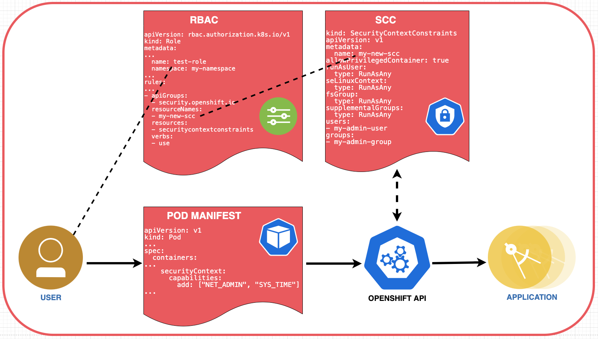

# OpenShift Security Practices using SCC

To better understand how both Role-Based Access Control (**RBAC**) and Security Context Contraints (**SCC**) are used to control access on an OpenShift Container Platform, let's walk-through a common deployment scenario.

First, let's identify the personas that are typically involved in the process of developing an application, configuring a pod to contain the application, and then deploying that pod on an OpenShift Container Platform.

* **Programmer** - responsible for developing the app or service that will run in the pod.
* **Deployer** - responsible for creating the deployment manifest that will define how the pod will be deployed and run.
* **Administrator** - ensures the security of the platform by limiting priviledges.

Administrators use **RBAC** resources to control user access. In our example, the administrator will grant the "deployer" the permission to deploy pods. We won't worry about permissions for the "programmer" since they don't typically need access to the cluster.

If the application is a typical stateless workload, the "deployer" will generate a basic deployment manifest, and the pod will be deployed without any issues.

But what if the application requires access to storage, networking services, or user management (SITE BETTER/CLEARER USE CASES)? This will require that the "deployer" request additional permissions or capabilities in the manifest. And how is it determined if the request is allowed? This is where SCCs come into play.

SCCs are associated with users, groups, and/or service accounts, typically via RBAC roles. When a pod is deployed, the SCCs associated with the user or service account that owns the pod (typically the one used to deploy the pod) specify which protected resources the pod can access. If the SCCs allow all of the capabilities that the pod requests, the pod is allowed to start running; otherwise, starting the pod fails.

If the pod is denied the requested capabilities, the "administrator" will need to:

* determine that the requested capabilities in the manifest are in fact needed.
* determine what SCC will allow the requested capabilities, or if none exist, create a new one.
* assign the SCC to a role for the appropriate users, groups, and/or service accounts, or create such a role if needed.
* assign the "deployer" to this new role.

Here is an overview of how roles and SCCs are involved in the deployment process:


1. The RBAC/Cluster administrator creates a role which is assigned a security context constraint
1. The administrator grants "deployment" permissions to the deployer user account
1. Outside the OpenShift cluster environment, the programmer develops an application or service, and ...
1. Delivers the application to the deployer
1. The deployer creates a pod deployment manifest that may or may not requests additional capabilities
1. The manifest is processed by the OpenShift container platform
1. The pod is deployed in the OpenShift container platform
1. When OpenShift attempts to start the pod, it compares the pods requested capabilities against the SCC associated with the pod owner. If the SCC has all of the capabilities the pod requests, the cluster will allow the pod to start. Otherwise, the pod will fail with some specific start-failed error status.

Now that we have a high-level view of how deployment security is handled on an OpenShift container platform, let's dig into the details.

## Default SCCs

Each Openshift cluster contains 8 default SCCs, each specifying a set of allowed capabilities:

* **restricted** -  denies access to all host features and requires pods to be run with a user ID (UID), and SELinux context that are allocated to the namespace.
* **anyuid** - same as restricted, but allows users to run with any UID and group ID (GID).
* **hostaccess** - allows access to all host namespaces but still requires pods to be run with a UID and SELinux context that are allocated to the namespace.
* **hostmount-anyuid** - provides all the features of the restricted SCC but allows host mounts and any UID by a pod.  This is primarily used by the persistent volume recycler.
* **hostnetwork** - allows using host networking and host ports but still requires pods to be run with a UID and SELinux context that are allocated to the namespace.
* **node-exporter** -  is only used for the Prometheus node exporter.
* **nonroot** - provides all features of the restricted SCC but allows users to run with any non-root UID.
* **privileged** - allows access to all privileged and host features and the ability to run as any user, any group, any fsGroup, and with any SELinux context.

SCCs can be assigned to specific RBAC roles created on the OpenShift platform. Users associated with those roles are then permitted to use the capabilites set by the SCC. If an SCC is not associated with an RBAC role, the **restricted** SCC is used.

## Managing SCCs

Administrators can manage the SCCs on the OpenShift platform via the OpenShift CLI.

```bash
oc get scc
oc get scc <scc name> -o yaml
oc describe scc <scc name>
oc edit scc <scc name>
oc delete scc <scc name>
```

When determining which SCC to assign, it is important to remember that less is better. If your pod requires capability A, don't select an SCC that provides capalities A, B, and C.

If none of the default SCCs provide exactly what you are looking for, you can create a custom one. It requires you submit a YAML file, such as the following:

```yaml
kind: SecurityContextConstraints
apiVersion: v1
metadata:
  name: my-new-scc
allowPrivilegedContainer: true
runAsUser:
  type: RunAsAny
seLinuxContext:
  type: RunAsAny
fsGroup:
  type: RunAsAny
supplementalGroups:
  type: RunAsAny
users:
- my-admin-user
groups:
- my-admin-group
```

Submit the SCC definition file using the `oc create` command:

```bash
oc create -f my-scc.yaml
```

## Assign SCCs to RBAC roles

On OpenShift, an administrator can create a **Role** with a rule to define which SCCs will be available for all the users associated with that role.

Roles are defined by a YAML file. For example:

```yaml
apiVersion: rbac.authorization.k8s.io/v1
kind: Role
metadata:
...
  name: test-role
  namespace: my-namespace
...
rules:
...
- apiGroups:
  - security.openshift.io                       # location of SCCs
  resourceNames:
  - my-new-scc                                  # SCC name
  resources:
  - securitycontextconstraints                  # indicates this is an SCC
  verbs:
  - use                                         # "use" is only allowed action on an SCC
```

## Deployment Manifests

To deploy a pod, it must have a JSON or YAML file called a pod manifest.

```yaml
apiVersion: v1
kind: Pod
metadata:
  name: nginx-pod
  labels:
    name: web-app
spec:
  securityContext:                         # Pod security
    runAsUser: 1000
    runAsGroup: 3000
    fsGroup: 2000
  containers:
  - name: web-app-container
    image: nginx
    securityContext:                       # Container security
      capabilities:
        add: ["NET_ADMIN", "SYS_TIME"]
    resources:
      limits:
        memory: "128Mi"
        cpu: "500m"
    ports:
      - containerPort: 80
...
```

The `securityContext` object is used to request capabilities for both the pod and for all containers within in the pod. To be accepted, the capabilites must match what is allowed by the associated SCC.

## SCC Admission Process

As shown in the workflow diagram above, when a user makes a pod request, OpenShift compares the capabilities requested by the pod against what the associated SCC allows.

When multiple SCCs are available to the user, OpenShift will prioritize them.

SCCs have a priority field that affects the ordering when a pod request is validated. A higher priority SCC is moved to the front of the set when sorting. When the complete set of available SCCs are determined they are ordered by:

* Highest priority first, nil is considered a 0 priority
* If priorities are equal, the SCCs will be sorted from most restrictive to least restrictive
* If both priorities and restrictions are equal the SCCs will be sorted by name

## Detailed Flow

Now that we have covered all of the details, we can update our initial flow diagram:



## Misc notes

Cover ## availablecapabilities/constraints (SELinuxpolicies,AppArmorprofiles,  etc.)

When an application is deployed it will run as a user ID unique to the project it is running in. This overrides the user ID which the application image defines it wants to be run as. That the application is run as a different user ID can result in it failing to start.

The best solution is to build the application image so it can be run as an arbitrary user ID. This avoids the risks associated with having to run an application as the root user ID, or other fixed user ID which may be shared with applications in other projects.

If an image can't be modified, you can elect to override the default security configuration of OpenShift and have it run as the user the image specifies, but this can only be done by an administrator of the OpenShift cluster. This cannot be done by normal developers, nor a project administrator. This cannot be done on hosting services such as OpenShift Online.

The change required to override the default security configuration, is to grant rights to the **service account the application is run under**, to run images as a set user ID.

By default applications would run under the restricted SCC. The MustRunAsRange value for RUNASUSER is what indicates that the application needs to run within the user ID range associated with the project.

To allow an application to be run as any user ID, including the root user ID, you want to use the anyuid SCC

### pod manifest

runAsUser: 1000 - means all containers in the pod will run as user UID 1000
fsGroup: 2000 - means the owner for mounted volumes and files created in that volume will be GID 2000

Capability values: https://github.com/torvalds/linux/blob/master/include/uapi/linux/capability.h

### SCC yaml

Access:
  Users: <none>   // which users and service accounts the SCC is applied to
  Groups: system:authenticated   // which groups the SCC is applied to

runAsUser: RunAsAny  // the SCC can allow arbitrary IDs, and ID that falls into a range, or exact user ID specific to the request 

Add an SCC to a group:
```bash
$ oc adm policy add-scc-to-group <scc_name> <group_name>
```

Add an SCC to all service accounts in a namespace:
```bash
$ oc adm policy add-scc-to-group <scc_name> \
    system:serviceaccounts:<serviceaccount_namespace>
```
