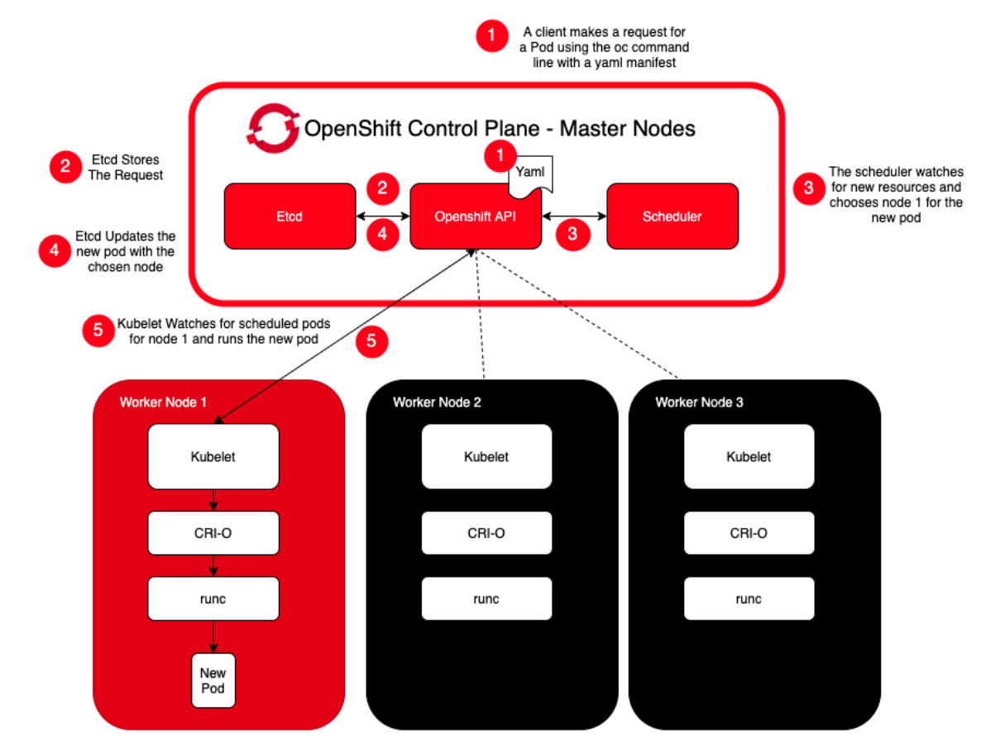
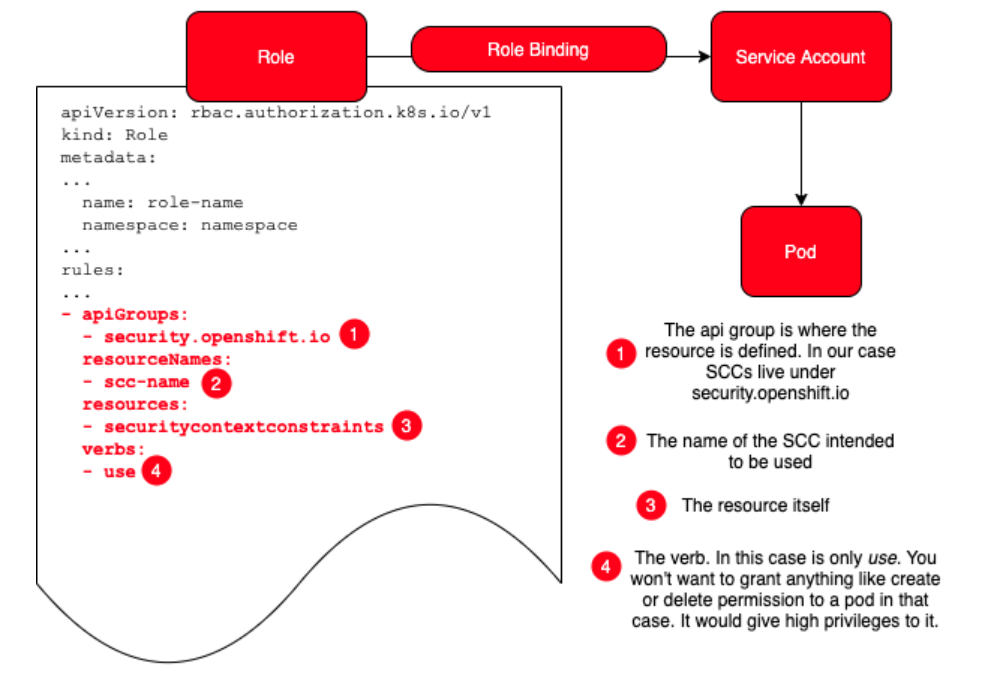
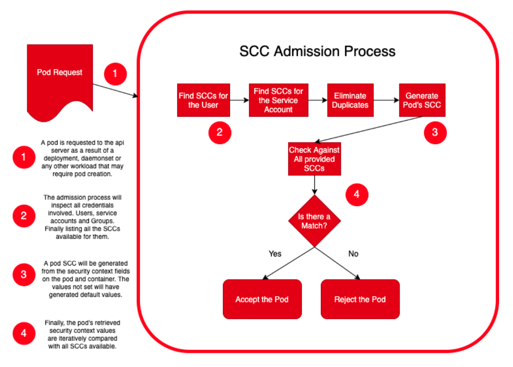

# OpenShift Security Practices using SCC

Red Hat OpenShift is a Kubernetes based platform that allows you to run containerized applications and workloads.

This article details how OpenShift administrators can use Security Context Contraints (SCC) to control permissions for deployed pods. These permissions include what actions a pod, or a collection of containers, can perform and what resources it can access.

In a nutshell, SCCs are used to define a set of conditions that a pod must comply with in order to be accepted onto the OpenShift plafform.

Before we begin, let's first cover some basic OpenShift/Kubernetes definitions.

* **Container** - the basic usit of an OpenShft application. Containers isolate running processes to that they are limited to interacting with only their designated resources. Typically, each container provides a single service (i.e. micro-service).
* **Pod** - the smallest unit of a Kubernetes application. A pod can be composed of multiple, tightly coupled containers, or just a single container. Containers are grouped into pods to provide intelligent resource sharing and balancing.
* **NameSpace** - used to create virtual clusters within a physical cluster. Each namespace has its own resource quotas and logically isolated cluster resources.
* **Project** - a namespace with additional annotations, such as objects, policies, contraints and service accounts. Used to organize communities of users.
* **Service Account** - acts automatically with designated access to objects in a project. Service accounts provide a flexible way to control API access without sharing regular user credentials.

## Red Hat Openshift workflow

The following flow describes how a Kubernetes pod is scheduled and run on the OpenShift container platform:



1. It starts with a an API call to OpenShift to run a specific pod.

    Kubernetes pods are defined by a YAML or JSON file called a pod manifest.

    Here is an example of a pod manifest YAML file:

    ```yaml
    apiVersion: v1
    kind: Pod
    metadata:
      name: nginx-pod
      labels:
        name: web-app
    spec:
      containers:
      - name: web-app-container
        image: nginx
        resources:
          limits:
            memory: "128Mi"
            cpu: "500m"
        ports:
          - containerPort: 80
    ```

1. The API will process the request and trigger an event by storing the request in `etcd`.
1. The `Scheduler` sees the event and chooses which node will run the pod.
1. `etcd` updates the pod to run on the selected node.
1. The `kubelet` process running in that node sees the new pod event and calls the OpenShift container runtime (CRI-O) with all of the parameters and options requested by the pod.

## What about security?

The OpenShift container platform is goverened by role-based access control (RBAC). OpenShift administrators can use the cluster roles and bindings to control who has various access levels to the OpenShift container platform itself and to all its projects.

Aditionally, administrators can use security context to control permissions for pods. This includes what actions can be performed, and what resources can be accessed on the OpenShift container platform.

Every pod manifest file can contain 2 objects to request desired priveleges:

* PodSecurityContext - relates to the pod
* SecurityContext - relates to the specific container in the pod

>**Important**: SecurityContext takes precedence over the PodSecurityContext.

Building on our YAML file example, here we show how we can add both `securityContext` objects to our pod manifest:

```yaml
...
spec:
  securityContext:             # Pod security
    runAsUser: 1000
    runAsGroup: 3000
    fsGroup: 2000
  containers:
  - name: web-app-container
    image: nginx
    securityContext:           # Container security
      capabilities:
        add: ["NET_ADMIN", "SYS_TIME"]
...
```

Note that the security context object is used to request privileges from the OpenShift container runtime. If the privileges cannot be granted, the pod will not be scheduled.

In order to make this determination, the security context objects are compared to the **Security Context Constraints** (SCCs) that have been set for the OpenShift platform.

## What is SCC?

Similar to the way that RBAC resources control user access, administrators can use **Security Context Constraints** (SCCs) to control permissions for pods that are requesting permission to run on the OpenShift platform. These permissions include actions that a pod, or a collection of containers, can perform and what resources it can access. You can use SCCs to define a set of conditions that a pod must comply with in order to be accepted.

SCCs allows an administrator to control:

* Whether a pod can run privileged containers.
* The capabilities that a container can request.
* The use of host directories as volumes.
* The SELinux context of the container.
* The container user ID.
* The use of host namespaces and networking.
* The allocation of an FSGroup that owns the pod’s volumes.
* The configuration of allowable supplemental groups.
* Whether a container requires the use of a read only root file system.
* The usage of volume types.
* The configuration of allowable seccomp profiles.

Each cluster contains 8 default SCCs:

* anyuid
* hostaccess
* hostmount-anyuid
* hostnetwork
* node-exporter
* nonroot
* privileged
* restricted

Each SCC has a set of capabilites. For example, the **restricted** SCC:

* Ensures that pods cannot run as privileged.
* Ensures that pods cannot mount host directory volumes.
* Requires that a pod run as a user in a pre-allocated range of UIDs.
* Requires that a pod run with a pre-allocated MCS label.
* Allows pods to use any FSGroup.
* Allows pods to use any supplemental group.

The **restricted** SCC is the default, and will accept pod configurations that don't request any special security contexts.

## Managing SCCs

Administrators can manage the SCCs on the OpenShift platform via the OepnShift CLI.

```bash
oc get scc
oc get scc <scc name> -o yaml
oc describe scc <scc name>
oc edit scc <scc name>
oc delete scc <scc name>
```

To build a custom SCC, create a YAML file. For example:

```yanl
kind: SecurityContextConstraints
apiVersion: v1
metadata:
  name: scc-admin
allowPrivilegedContainer: true
runAsUser:
  type: RunAsAny
seLinuxContext:
  type: RunAsAny
fsGroup:
  type: RunAsAny
supplementalGroups:
  type: RunAsAny
users:
- my-admin-user
groups:
- my-admin-group
```

Then submit the file:

```bash
oc create -f my-scc.yaml
```

The `oc adm policy` command to bind SCCs to a user, service account, or group.

```bash
add-scc-to-user           // Add security context constraint to users or a service account
add-scc-to-group          // Add security context constraint to groups
remove-scc-from-user      // Remove user from scc
remove-scc-from-group     // Remove group from scc
```

## Using SCC with RBAC

On an OpenShift container platform, you can create a **Role** with a rule to define which SCCs will be available for the Service Accounts bound to that role.



1. Define where the resource is defined. SCCs are all in **security.openshift.io**.
1. Name of the SCC to be made available.
1. Set the type of the resource.
1. What **permission** to grant the role. For SCC, this is always set to **use**.

## SCC Admission Process

Now that we understand what an SCC is, we can discuss how they are used to determine if a requested pod has the right permissions to run on the OpenShift platform.

In order to be accepted, there must be a match between the pods requested resource security context and the assigned set of SCCs.



1. A pod request is made.
1. All credentials are inspected, including:
    * User account making the request
    * Service account for the namespace
1. An SCC for the pod is generated.
1. The pod SCC is compared against all available SCCs. 

### SCC prioritization

SCCs have a priority field that affects the ordering when a pod request is validated. A higher priority SCC is moved to the front of the set when sorting. When the complete set of available SCCs are determined they are ordered by:

* Highest priority first, nil is considered a 0 priority
* If priorities are equal, the SCCs will be sorted from most restrictive to least restrictive
* If both priorities and restrictions are equal the SCCs will be sorted by name

## availablecapabilities/constraints (SELinuxpolicies,AppArmorprofiles,  etc.)

## An Example
