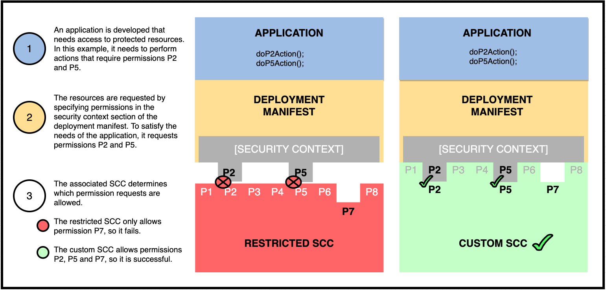

# Red Hat OpenShift security practices using security context contraints

To better understand how Security Context Contraints (**SCC**) are used to control access on a Red Hat OpenShift Container Platform, let's walk-through a common deployment scenario.

First, let's identify the personas that are typically involved in the process of developing an application, configuring a pod to contain the application, and then deploying that application on OpenShift.

* **Programmer** - responsible for developing the application or service that will run in the pod.
* **Deployer** - responsible for creating the deployment manifest that will define how the application will be run.
* **OpenShift User** - a user account granted deployment permissions by the OpenShift administrator.
* **OpenShift Service Account** - a special type of user account that can be created to be associated with one or more SCCs.
* **OpenShift Administrator** - ensures the security of the OpenShift platform by granting access to protected resources only as needed.

Administrators use Role-Based Access Control (**RBAC**) resources to control user access. In our scenario, the administrator will create an **OpenShift User** account that has the permission to deploy pods. The **Deployer** can then use that account to create and deploy the pod on OpenShift. The **Deployer** performs this task by creating a **deployment manifest**, which links to the application and provides instructions on how the application should be deployed and ran.

If the application is a typical stateless workload (i.e. requiring no special permissions), the **Deployer** will generate a basic deployment manifest, and the pod will be deployed without any issues.

But what if the application requires access to protected resources such as local storage, networking services, or needs to run under specific user or group identities? In this case the **Deployer** will need to enhance the deployment manifest to request the additional permissions. And who gets to decide if the requests should be allowed or not? This is where SCCs and RBAC come into play.

SCCs are the tool provided by OpenShift to control what permissions can be granted to a pod - specifically what privileges are allowed, what user and group IDs can be assigned, and what additional capabilities can be granted. SCCs are associated with users, groups, and/or service accounts - typically via RBAC roles. Therefore, when the  **Deployer** attempts to deploy the pod, the deployment manifest will specify what **OpenShift Service Account** to use, which in turn is associated with a role and an SCC.

If the SCC allows all of the requested permissions made by the deployment manifest, the deployment is created and the pod/application is run.

If the pod is denied the requested permissions, the **OpenShift Administrator** will need to:

* Determine if the additional requests made in the manifest are in fact needed.
* Determine what SCC will allow the requested permissions, or if none exist, create a new one.
* Assign the SCC to a role for the appropriate users, groups, and/or service accounts, or create such a role if needed.
* Assign the new role to the **OpenShift Servvice Account**.

Here is an overview of how user and service accounts, roles, deployment manifiests, and SCCs are involved in the deployment process:


1. The **Programmer** develops an application or service, and ...
1. Delivers the application to the **Deployer**, who creates a deployment manifest for the application.
1. The **OpenShift Administrator** creates roles which are assigned a security context constraint.
1. The **OpenShift Administrator** creates an **OpenShift User Account** and assigns it a role that provides deployment permissions. Also created is an **OpenShift Service Account** that is associated with one or more SCCs.
1. The **Deployer** logs into OpenShift using the new **OpenShift User Account**, and deploys the application using the deployment manifest. The manifest may contain a request for additional permissions, and may reference which **OpenShift Service Account** to use when deploying the pod.
1. OpenShift processes the manifest and attempts to deploy the pod. The deployment process will compare the permissions requested by the deployment manifest against the permissions allowed by the associated SCCs.
1. If the associated SCC cannot provide all of the permissions the deployment manifest requests, the deployment will fail.
1. Otherwise, the deployment will create the pod and run the application.

TODO: do we need more detail on the actual deployment? what actually fails - deployment, pod creation, pod starting...

Now that we have a high-level view of how deployment manifests work with SCCs on OpenShift, let's dig into the details.

## Permissions requested vs. permissions allowed

In the flow diagram above, you see that the pod will only be deployed if the requested permissions defined in the deployment manifest match the allowed permissions defined by the SCC.

Another way to envision this relationship is to think of the SCC as a lock protecting system resources, and the manifest being the key. The app only gets access to the resources if the key fits.



## Types of permissions that can be requested

Up to this point we have used the generic term "permissions" to describe what pods can request (via the deployment manifest) and what SCCs will allow. In reality, "permissions" consist of 3 specific types - privileges, access control, and capabilities. Each with its own set of rules and syntax.

### Privileges  

* **allowPrivilegedContainer** - can a pod run privileged containers
* **allowHostNetwork**
* **aloowHostPorts**

### Access Control

Controls what specific user or group ID a pod may run as.

In the SCC, The list of fields that can be set include:
  
* **RunAsUser** - specifies the allowable range of user IDs used for running all the containers in the pod.
* **SupplementalGroups** - specifies the allowable range of group IDs used for rulling all the containers in the pod.
* **FSGroup** -  specifies the allowable range of group IDs used for controlling pod storage volumes.
* **SELinuxContext** - specifies the allowable values used for setting the SELinux context, suas SELinux user, role, type and level.

In the deployment manifest, these values are set at the pod level and pertain to all containers running within the pod. The fields used are:

* **securityContext.runAsUser** - request to run under a specific user ID.
* **securityContext.runAsGroup** - request to run under a specific group ID.
* **securityContext.fsGroup** - request to run under a specific group ID for accessing storage volumes.
* **securityContext.XXXXXX** - request to run using a specific SELinux context.

### Capabilities

Permission to perform specific actions, like access system time, or configure network settings. These capabilities are assigned to individual containers running within the pod, and take precedent over any pod settings.

The list of actions includes:

* CHOWN - change file ownership and group ownership
* KILL - can send signal to process without having matching user ID
* NET_BROADCAST - can broadcast and listening to multicast
* NET_ADMIN - can configure interfaces, routing tables, multicast, admin of IP firewall, etc.
* SYS_CHROOT - can use chroot command
* SYS_ADMIN - can set domain and host names, run mount and unmount, lock/unlock shared memory, etc.
* SYS_TIME - can manipulate system clock
* MKNOD - provides privileged aspects of mknod()
* SETCAP - can set or remove capabilities on files 

A full list of values can be found [here](https://github.com/torvalds/linux/blob/master/include/uapi/linux/capability.h)

Capabilities are specified in the SCC using the following fields:

* **defaultAddCapabilities** - list of default capabilities added to each container.
* **requiredDropCapabilities** - list of capabilities that will be forbidden to run on each container.
* **allowedCapabilities** - list of container capabilities that are allowed to be requested by the demployment manifest.

Capabilities are requested in the deployment manifest using the **securityContext.capabilities.add** field.

## Pre-defined SCCs

Each Openshift cluster contains 8 pre-defined SCCs, each specifying a set of allowed permissions:

* **restricted** -  denies access to all host features and requires pods to be run with a user ID (UID), and SELinux context that are allocated to the namespace.
* **anyuid** - same as restricted, but allows users to run with any UID and group ID (GID).
* **hostaccess** - allows access to all host namespaces but still requires pods to be run with a UID and SELinux context that are allocated to the namespace.
* **hostmount-anyuid** - provides all the features of the restricted SCC but allows host mounts and any UID by a pod.  This is primarily used by the persistent volume recycler.
* **hostnetwork** - allows using host networking and host ports but still requires pods to be run with a UID and SELinux context that are allocated to the namespace.
* **node-exporter** -  is only used for the Prometheus node exporter.
* **nonroot** - provides all features of the restricted SCC but allows users to run with any non-root UID.
* **privileged** - allows access to all privileged and host features and the ability to run as any user, any group, any fsGroup, and with any SELinux context.

If not specified, the **restricted** SCC will be used.

## Managing SCCs

Administrators can manage the SCCs on the OpenShift platform via the OpenShift CLI.

```bash
oc get scc
oc get scc <scc name> -o yaml
oc describe scc <scc name>
oc edit scc <scc name>
oc delete scc <scc name>
```

Here is a snippet of what the **restricted** SCC YAML file looks like:

```yaml
$ oc get scc restricted  -o yaml
kind: SecurityContextConstraints
apiVersion: security.openshift.io/v1
metadata:
  name: restricted
...
# Privileges
allowPrivilegedContainer: false
allowHostNetwork: false
allowHostPID: false
...
# Capabilities
allowedCapabilities: null
defaultAddCapabilities: null
requiredDropCapabilities:
- KILL
- MKNOD
- SETUID
- SETGID
...
# Access Control
fsGroup:
  type: MustRunAs
runAsUser:
  type: MustRunAsRange
seLinuxContext:
  type: MustRunAs
supplementalGroups:
  type: RunAsAny
...
```

Note how locked down this SCC is - it doesn't allow any special privileges or capabilities. As for access control, it uses the following restrictions:

* **MustRunAs** and **MustRunAsRange** enforces the range of ID values that can be requested by a container, and also assigns a default value if needed.
* **RunAsAny** indicates that no range checking is performed and no default value is assigned, thus allowing any ID to be requested.

## Creating custom SCCs

When determining which SCC to assign, it is important to remember that less is better. If your pod requires permission A, don't select an SCC that provides permissions A, B, and C.

If none of the default SCCs provide exactly what you are looking for, you can create a custom one. One way to create one is by creating a YAML file, such as the following:

```yaml
kind: SecurityContextConstraints
apiVersion: v1
metadata:
  name: my-custom-scc
fsGroup:
  type: MustRunAs 
  ranges:
  - min: 2000
    max: 3000
runAsUser:
  type: MustRunAsRange 
  uidRangeMin: 1000
  uidRangeMax: 2000
seLinuxContext: 
  type: MustRunAs
  SELinuxOptions: 
    user: u0
    role: r0
    type: t0
    level: l0
supplementalGroups:
  type: MustRunAs 
  ranges:
  - min: 3000
    max: 4000
defaultAddCapabilities:
- CHOWN
- SYS_TIME
requiredDropCapabilities:
- MKNOD
allowedCapabilites:
- NET_ADMIN   
```

You can create the SCC by submitting the SCC definition file using the following command:

```bash
oc create -f <file-name>.yaml
```

To view the created SCC, use the command:

```bash
oc get scc my-custom-scc -o yaml
```

You can also view the SCC with the `describe` command:

```bash
$ oc describe scc/my-custom-scc
Name:                           my-custom-scc
Priority:                       <none>
Access:
  Users:                        <none>
  Groups:                       <none>
Settings:
  Allow Privileged:             false
  Allow Privilege Escalation:   true
  Default Add Capabilities:     SYS_TIME,SETGID,SETUID
  Required Drop Capabilities:   KILL,MKNOD
  Allowed Capabilities:         <none>
  Allowed Seccomp Profiles:     <none>
  Allowed Volume Types:         awsElasticBlockStore,azureDisk,azureFile,cephFS,cinder,configMap,csi,downwardAPI,emptyDir,fc,flexVolume,flocker,gcePersistentDisk,gitRepo,glusterfs,iscsi,nfs,persistentVolumeClaim,photonPersistentDisk,portworxVolume,projected,quobyte,rbd,scaleIO,secret,storageOS,vsphere
  Allowed Flexvolumes:          <all>
  Allowed Unsafe Sysctls:       <none>
  Forbidden Sysctls:            <none>
  Allow Host Network:           false
  Allow Host Ports:             false
  Allow Host PID:               false
  Allow Host IPC:               false
  Read Only Root Filesystem:    false
  Run As User Strategy: MustRunAsRange
    UID:                        <none>
    UID Range Min:              1000
    UID Range Max:              2000
  SELinux Context Strategy: RunAsAny
    User:                       <none>
    Role:                       <none>
    Type:                       <none>
    Level:                      <none>
  FSGroup Strategy: MustRunAs
    Ranges:                     5000-6000
  Supplemental Groups Strategy: MustRunAs
    Ranges:                     5000-6000
```

## How to associate an SCC with a deployment manifest

Once we have decided which SCC to use (pre-existing or custom), how do we get our deployment manifest to use it?

There a variety of ways to do this, but before we get into the details, let's make sure we know what objects are involved, and how to create them.

* Project
* RBAC Role
* Service Account
* SCC
* Deployment Manifest

### Project namespace

The first step is to set the OpenShift project to work in. This will provide the namespace to manage your resources.

To create a new project named `scc-test-project` and set it as your default, use the command:

```bash
oc new-project scc-test-project
```

If you want to use an existing project, use:

```bash
oc project <project-name>
```

We can see the details of the project using the `describe` command:

```bash
$ oc describe project scc-test-project
Name:           scc-test-project
Labels:         <none>
Annotations:    openshift.io/description=
                openshift.io/display-name=
                openshift.io/sa.scc.mcs=s0:c25,c15
                openshift.io/sa.scc.supplemental-groups=1000630000/10000
                openshift.io/sa.scc.uid-range=1000630000/10000
...
```

Take note of the `openshift.io/sa.scc` annotation values. These will be used as default values when processing SCCs later in this article.

The annotations define default values for (in order): SELinux options, group IDs, and user IDs. These values are only used if the corresponding SCC access control setting is NOT **RunAsAny**, AND when not specified in the SCC or deployment manifest. More on this later.

### RBAC Roles

On OpenShift, an administrator can create a **Role** with a rule to define which SCCs will be available for all the users associated with that role.

There are 2 types of RBAC roles, **local** roles are limited to specific projects, while **cluster** roles apply to the entire OpenShift platform and all projects. For our scenario, we will just focus on **local** roles.

To create a local role named `my-custom-role` that points to our custom SCC, use the command:

```bash
oc create role my-custom-role --verb=use --resource=scc --resource-name=my-custom-scc -n scc-test-project
```

To view the new role, use the command:

```bash
$ oc describe roles/my-custom-role
Name:         my-custom-role
Labels:       <none>
Annotations:  <none>
PolicyRule:
  Resources                                         Non-Resource URLs  Resource Names   Verbs
  ---------                                         -----------------  --------------   -----
  securitycontextconstraints.security.openshift.io  []                 [my-custom-scc]  [use]
```

### Service accounts

Service accounts are basically user accounts, but are more flexible in that you don't have to share a regular user's credentials.

Each service account's user name is derived from its project and name:

```bash
system:serviceaccount:<project>:<name>
```

Use the following command to create a new service account in our current project:

```bash
oc create sa my-custom-service-account
```

Get the details for the new service account using the command:

```yaml
$ oc get sa my-custom-service-account -o yaml
apiVersion: v1
imagePullSecrets:
- name: my-custom-service-account-dockercfg-zgzx9
kind: ServiceAccount
metadata:
  creationTimestamp: "2021-02-16T19:46:00Z"
  name: my-custom-service-account
  namespace: scc-test-project
  resourceVersion: "8920053"
  selfLink: /api/v1/namespaces/scc-test-project/serviceaccounts/my-custom-service-account
  uid: 8c915529-897b-4eaa-860b-5b7ec5ae4583
secrets:
- name: my-custom-service-account-token-b2p5k
- name: my-custom-service-account-dockercfg-zgzx9
```

### Tie them all together

Now that we have all the pieces, let's get into how we can link the SCC to our deployment manifest.

There are 2 ways to accomplish this:

#### Assign SCCs to RBAC roles

When we created our RBAC role, we associated it with a specific SCC. We also created a new service account. The final step is to associate the service account with the role.

To assign our role to our service account, use the command:

```bash
oc adm policy add-role-to-user my-custom-role -z my-custom-service-account -n scc-test-poject
```

To see the new association, use the command:

```bash
$ oc describe rolebinding.rbac -n scc-test-project
...
Name:         my-custom-role
Labels:       <none>
Annotations:  <none>
Role:
  Kind:  ClusterRole
  Name:  my-custom-role
Subjects:
  Kind            Name                         Namespace
  ----            ----                         ---------
  ServiceAccount  my-custom-service-account    scc-test-project
...
```

Note that our custom service account is now associated with our custom role.

#### Assign service accounts to an SCC

Another approach is to directly assign a service account to an SCC.

Here are the commands to create a service account, then assign it to our custom SCC:

```bash
oc adm policy add-scc-to-user my-custom-scc -z my-custom-service-account
```

This will update the SCC to include a list of assigned users:

```yaml
$ oc get scc my-custom-scc -o yaml
...
kind: SecurityContextConstraints
apiVersion: v1
metadata:
  name: my-custom-scc
users:
- my-custom-service-account
...
```

Note that our custom service account is now associated with our custom SCC.

## Deployment Manifest details

A deployment manifest is used to create and build a deployment, which can be then used to deploy a pod.

Here is a snippet of what a deployment manifiest YAML file looks like:

```yaml
apiVersion: apps/v1
kind: Deployment
metadata:
  name: my-test-deployment
  labels:
    app: my-app
spec:
  replicas: 3
  selector:
    matchLabels:
      app: my-app
  template:
    metadata:
      labels:
        app: my-app
    spec:
      serviceAccountName: my-custom-service-account
      securityContext:
        runAsUser: 1000
        runAsGroup: 3000
        fsGroup: 2000
      containers:
      - name: web-app-container
        image: nginx:1.14.2
        securityContext:
          capabilities:
            add: ["NET_ADMIN", "SYS_TIME"]
        ports:
        - containerPort: 80
...
```

The `serviceAccountName` object defines the service account to use during deployment. As shown earlier, it can be tied to an SCC either directly or via its associated role.

The `securityContext` object is used to request capabilities for both the pod and for all containers within in the pod. To be accepted, the capabilites must match what is allowed by the associated SCC.

The first set of `securityContext` values are associated with the pod. The entries relate to what ID values are to be assigned to all containers running in the pod. For example,

* **runAsUser: 1000** - requests that all containers in the pod will run as user ID 1000.
* **runAsGroup: 3000** - request that all containers in the pod will run as group ID 3000.
* **fsGroup: 2000** - requests that the owner for mounted volumes and files created in that volume will be set to GID 2000.

The second set of `securityContext` values are associated with specific containers running inside the pod. For example:

* **capabilities - add** - requests that the `web-app-containter` container be allowed the `NET_ADMIN` and `SYS_TIME` capabilities .

## SCC Admission Process

As described earlier, OpenShift compares the permissions requested by the pod against what the associated SCC allows.

But what happens when multiple SCCs are available? In this case, OpenShift will prioritize them.

SCCs have a priority field that affects the ordering when a pod request is validated. A higher priority SCC is moved to the front of the set when sorting. When the complete set of available SCCs are determined they are ordered by:

* Highest priority first, nil is considered a 0 priority
* If priorities are equal, the SCCs will be sorted from most restrictive to least restrictive
* If both priorities and restrictions are equal the SCCs will be sorted by name

TODO: show deployment yaml after deployment to see which SCC was used
TODO: add more detail. Are the SCCs merged? What if one SCC allows, but is lower priority of another SCC that fails?

## Putting it all together

Using the examples from above, let's walk through the OpenShift SCC admission process to determine if our pod gets deployed or not.

First, let's revisit the OpenShift project we discussed earlier. The project plays a vital role as it provides default values when they are not specified in either the deployment manifest or SCC. Here are the important annotation field values again:

```yaml
$ oc get project scc-test-project -o yaml 
...
apiVersion: project.openshift.io/v1
kind: Project
metadata:
  name: default
  annotations:
    openshift.io/sa.scc.mcs: s0:c26,c5 
    openshift.io/sa.scc.supplemental-groups: 1000000000/10000
    openshift.io/sa.scc.uid-range: 1000000000/10000
...
```

### Deployment Vs. Restricted SCC

Let's check how our deployment manifest will fare against the **restricted** SCC.


### Deployment Vs. Custom SCC

Now let's try it against our **custom** SCC.


## Summary

TODO - point to the tutorial for more details and hands on exercises
