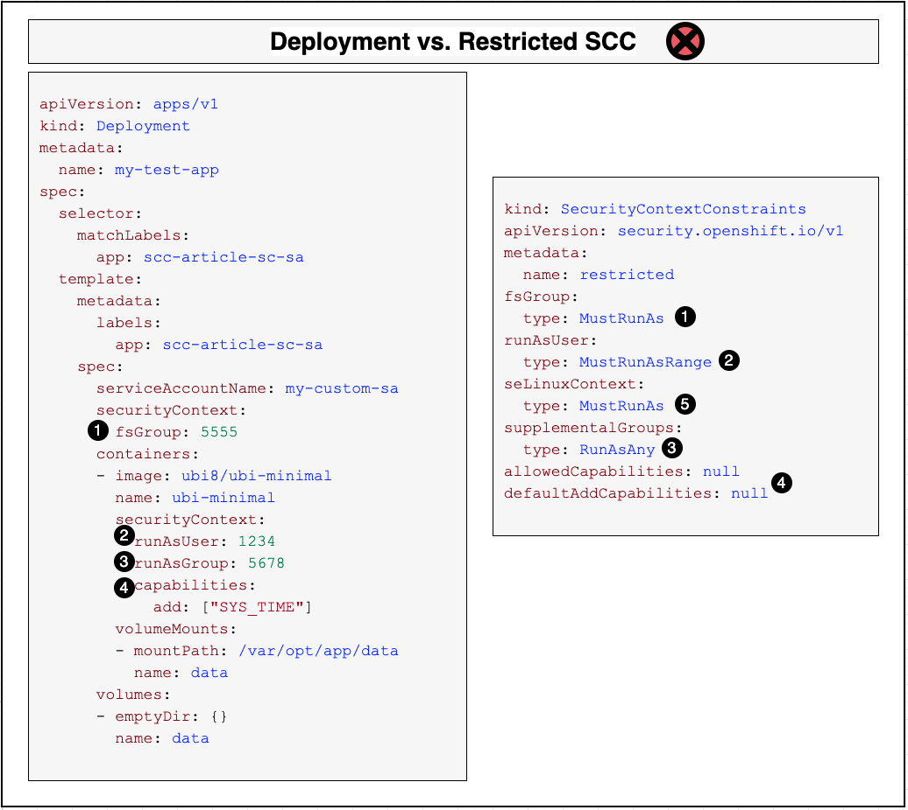
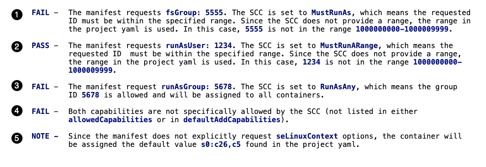
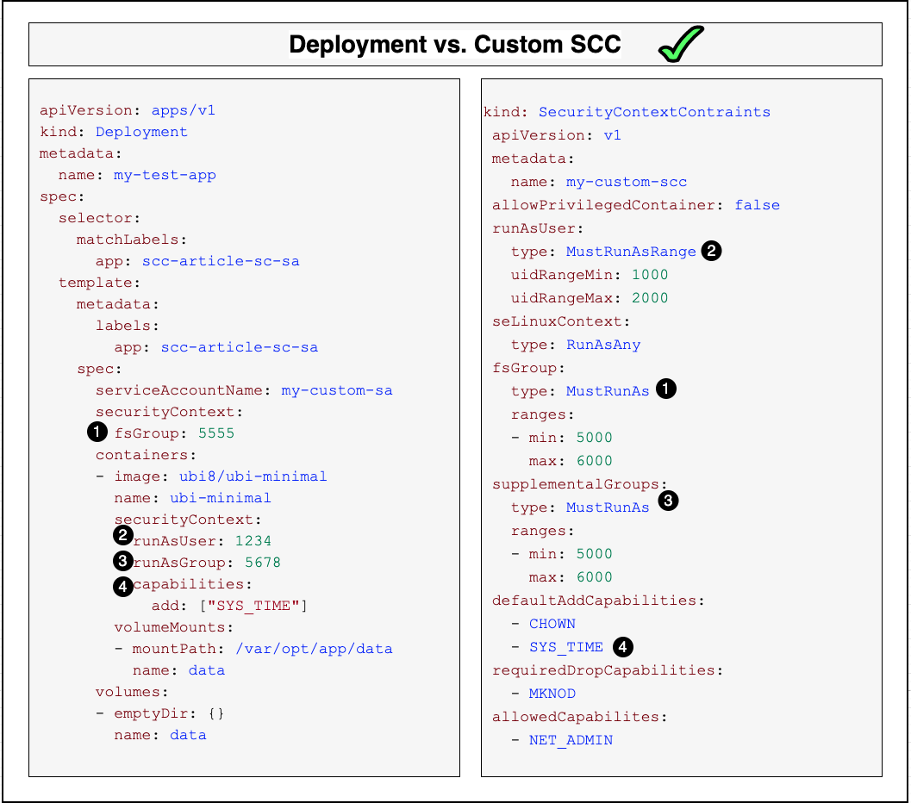

# Allow pods to access protected resources in Red Hat OpenShift using security context constraints

This article is the second in a two-part series on Red Hat OpenShift Security Context Constraints (SCCs). "[Introduction to Red Hat OpenShift security context constraints](https://github.ibm.com/TT-ISV-org/scc/blob/main/article/intro.md)" provides background information on what SCCs are and how they play a key role in configuring security in an OpenShift cluster.

This article builds on those concepts and digs into the details on how to properly utilize SCCs. This includes:
* Details on how SCCs allow permissions
* The predefined SCCs and when to use them
* How to create custom SCCs
* Details on how deployment manifests request permissions
* How to connect deployment manifests with SCCs

## Overview of SCCs

The main points from the first article are:
- By default, applications do not have permissions to access protected actions and resources
- When a developer implements an application that needs permissions to access protected actions and resources, the deployer must create a deployment manifest that requests those permissions in its security context, and the administrator must assign an SCC that grants those permissions
- The administrator makes an SCC available by assigning it to a service account, ideally via a role
- A manifest makes the SCC available to its pods by specifying the service account
- Admission allows the cluster to deploy the pods specified by the manifest only if the SCC grants all of the permissions that the manifest requests

With that in mind, let's explore in detail just how this works.

## How an SCC specifies permissions

Up to this point, we have used the generic term "permissions" to describe what pods can request (via the deployment manifest) and what SCCs will allow. OpenShift specifies permissions in three different aspects: privileges, access control, and capabilities.

Each aspect has its own set of rules and syntax. In the following sections, we show some of the available fields and values that can be used -- from both the deployment manifest side (asking permission) and the SCC side (granting permission).

### Privileges  

These settings describe general authority the pod will have when deployed. In an SCC or deployment manifest, a setting value of **true** means that the privilege is allowed.

Here are some example privileges in the SCC:

* `allowPrivilegedContainer` - specifies whether a pod can run containers with privileged processes
* `allowPrivilegeEscalation` - specifies if a child process can gain more privileges than its parent

The deployment manifest can request these privileges for a container. For example:

* `securityContext.privileged: true`

>**IMPORTANT**: Although an SCC can allow running [privileged containers](https://docs.docker.com/engine/reference/run/#runtime-privilege-and-linux-capabilities) and escalation, doing so makes the host much less secure. A privileged container allows a process running in the container "nearly all the same access to the host as processes running outside containers on the host." Arguably, if a container can't protect the host by containing a process, this nullifies a significant advantage of using containers. Also see "[Why Running Privileged Containers is Not Secure?](https://phoenixnap.com/kb/docker-privileged#htoc-why-running-privileged-containers-is-not-secure)"

### Access control

These settings control the specific user and group IDs the pod runs as.

In the SCC, the list of fields for specifying access include:
  
* `runAsUser` - specifies the allowable range of user IDs used for running all the containers in the pod
* `supplementalGroups` - specifies the allowable range of group IDs used for running all the containers in the pod
* `fsGroup` - specifies the allowable range of group IDs used for controlling pod storage volumes
* `seLinuxContext` - specifies the allowable values used for setting the SELinux context, which includes SELinux user, role, type, and level

Access control settings in an SCC can specify the following values:

* `MustRunAs` and `MustRunAsRange` enforces the range of ID values that can be requested by a container, and also assigns a default value if needed.
* `RunAsAny` indicates that no range checking is performed, thus allowing any ID to be requested. Note that this allows UID 0 (root) to be specified, which is significantly less secure than a non-root UID.
* `MustRunAsNonRoot` indicates that any non-root ID value (any UID other than 0) can be requested. This is similar to `RunAsAny` but much more secure.

The deployment manifest can request access for a container or a pod using these fields:

* `securityContext.runAsUser` - request to run under a specific user ID
* `securityContext.runAsGroup` - request to run under a specific group ID
* `securityContext.fsGroup` - request to run under a specific group ID for accessing storage volumes
* `securityContext.seLinuxOptions` - request to run using a specific SELinux context set of labels

> **NOTE**: [SELinux](https://www.redhat.com/en/topics/linux/what-is-selinux) (Security-Enhanced Linux) is a Linux kernel module that provides additional access control security, and provides the following benefits:
> * All processes and files are labeled. SELinux policy rules define how processes interact with files, as well as how processes interact with each other. Access is only allowed if an SELinux policy rule exists that specifically allows it.
> * Fine-grained access control. Stepping beyond traditional UNIX permissions that are controlled at user discretion and based on Linux user and group IDs, SELinux access decisions are based on all available information, such as an SELinux user, role, type, and, optionally, a security level.
> * SELinux policy is administratively-defined and enforced system-wide.
> * Improved mitigation for privilege escalation attacks. Processes run in namespaces, and are therefore separated from each other. SELinux policy rules define how processes access files and other processes.

### Capabilities

These settings control access to [Linux capabilities](https://man7.org/linux/man-pages/man7/capabilities.7.html), which are individual superuser privileges such as accessing system time or configuring network settings. These capabilities are assigned to individual containers running within the pod, and take precedent over any pod settings.

Examples of capabilities include:
* `CHOWN` - change file ownership and group ownership
* `KILL` - can send signal to process without having matching user ID
* `NET_BROADCAST` - can broadcast and listening to multicast
* `NET_ADMIN` - can configure interfaces, routing tables, multicast, admin of IP firewall, etc.
* `SYS_CHROOT` - can use chroot command
* `SYS_ADMIN` - can set domain and host names, run mount and unmount, lock/unlock shared memory, etc.
* `SYS_TIME` - can manipulate system clock
* `MKNOD` - provides privileged aspects of `mknod()`
* `SETCAP` - can set or remove capabilities on files 

The full list of capabilities is specified in [include/linux/capability.h](https://github.com/torvalds/linux/blob/master/include/uapi/linux/capability.h).

An SCC grants capabilities using these fields:

* `defaultAddCapabilities` - list of default capabilities automatically added to each container
* `requiredDropCapabilities` - list of capabilities that will be forbidden to run on each container
* `allowedCapabilities` - list of container capabilities that are allowed to be requested by the deployment manifest

The deployment manifest can request capabilities for a container using these fields:

* `securityContext.capabilities.add`
* `securityContext.capabilities.drop`

Any SCC specifies permissions using these three aspects: privileges, access control, and capabilities. OpenShift includes several predefined SCCs. An administrator can add to those by implementing custom SCCs.

## OpenShift's Predefined SCCs

An SCC can be predefined or custom. A predefined SCC is built-in to the cluster when the cluster is created. An administrator creates a custom SCC, which is then unique to that cluster. An administrator should not modify a predefined SCC; instead, create or modify a custom SCC. Any SCC is global to its cluster, so any SCC can be assigned to any service account, regardless of the project the service account is in.

Each Openshift cluster contains eight predefined SCCs, each specifying a set of permissions. This table from "[Managing SCCs in OpenShift](https://www.openshift.com/blog/managing-sccs-in-openshift)" lists and explains the predefined SCCs. (Note that UID is a user ID and GID is a group ID.)

| **SCC name** | **Description** | **Comments** |
|--------------|-----------------|--------------|
| **restricted** | Denies access to all host features and requires pods to be run with a UID and SELinux context from the set that the cluster assigns to the project. | This is the most secure SCC and is always used by default. Will work for most typical stateless workloads. |
| **nonroot** | Provides all features of the **restricted** SCC but allows users to run with any non-root UID. | Suitable for applications that need predictable non-root UIDs, but can function with all the other limitations set by the **restricted** SCC. |
| **anyuid** | Same as **restricted**, but allows users to run with any UID and GID. | This is very dangerous as it allows running as root user outside the container. If used, SELinux controls can play an important role to add a layer of protection. It's also a good idea to use **seccomp** to filter non desired system calls. |
| **hostmount-anyuid** | Provides all the features of the **restricted** SCC but allows host mounts and any UID by a pod.  This is primarily used by the persistent volume recycler, a trusted workload that is an essential infrastructure piece to the cluster. | This SCC should only be used by the persistent volume recycler. Same warnings as using **anyuid**, but goes further by allowing the mounting of host volumes. WARNING: This SCC allows host file system access as any UID, including UID 0. Grant with caution. |
| **hostnetwork** | Allows using host networking and host ports but still requires pods to be run with a UID and SELinux context that are assigned to the project. | This allows the pod to "see and use" the host network stack directly. Requiring the pod run with a non-zero UID and preassigned SELinux context will add some security. |
| **node-exporter** | Only used for the [Prometheus node exporter](https://prometheus.io/docs/guides/node-exporter/). (Prometheus is a popular Kubernetes monitoring tool.) | This SCC should only be used by Prometheus. It is designed specifically for Prometheus to retrieve metrics from the cluster. It allows access to the host network, host PIDS, and host volumes, but not host IPC. Also allows **anyuid**. Applications should **not** use this SCC. |
| **hostaccess** | Allows access to all host project namespaces but still requires pods to be run with a UID and SELinux context that are assigned to the project. | Access to all host namespaces is dangerous, even though it does restrict UID and SELinux. This should only be used for necessary trusted workloads. |
| **privileged** | Allows access to all privileged and host features, and the ability to run as any user, group, or fsGroup, and with any SELinux context. This is the most relaxed SCC policy. | This SCC allows a pod to control everything in the host and worker nodes, as well as other containers. Only trusted workloads should use this. There is a case to be made that this should never be used in production, as it allows the pod to completely control the host. |
<br>

> **IMPORTANT:** Do not modify the predefined SCCs. Customizing the predefined SCCs can lead to issues when OpenShift is upgraded. Instead, create new custom SCCs.

With this overview of the predefined SCCs, let's examine a predefined SCC in detail.

### Examining the restricted SCC

The `restricted` SCC is the default SCC because it is assigned to each project's `default` service account and therefore is the one used by all of the deployments that do not specify a service account. This also makes `restricted` the most commonly used SCC, so let's examine it in detail.

An SCC can be viewed using the following OpenShift CLI commands:

```bash
oc get scc <scc name> -o yaml
oc describe scc/<scc name>
```

Here is a snippet of what the YAML for the `restricted` SCC looks like (with comment lines added for clarity):

```yaml
$ oc get scc restricted  -o yaml
apiVersion: security.openshift.io/v1
kind: SecurityContextConstraints
metadata:
  name: restricted
...
# Privileges
allowPrivilegedContainer: false
allowHostNetwork: false
allowHostPID: false
...
# Capabilities
allowedCapabilities: null
defaultAddCapabilities: null
requiredDropCapabilities:
- KILL
- MKNOD
- SETUID
- SETGID
...
# Access Control
fsGroup:
  type: MustRunAs
runAsUser:
  type: MustRunAsRange
seLinuxContext:
  type: MustRunAs
supplementalGroups:
  type: RunAsAny
...
```

Note how locked down this SCC is -- it doesn't allow any special privileges or capabilities. However, it does allow any supplemental group ID to be specified, which enables pods to access the shared resources owned by a group.

In addition to the predefined SCCs built-in to a cluster, the administrator can also add custom SCCs.

## Creating a custom SCC

When determining which SCC to assign, it is important to remember that less is better. If a pod requires permission A, don't select an SCC that provides permissions A, B, and C.

If none of the predefined SCCs provides exactly the permissions an application requires, the administrator can create a custom one.

One way to create a custom SCC is using a YAML file, such as the following:

```yaml
apiVersion: v1
kind: SecurityContextConstraints
metadata:
  name: my-custom-scc
# Privileges
allowPrivilegedContainer: false
# Access Control
runAsUser:
  type: MustRunAsRange 
  uidRangeMin: 1000
  uidRangeMax: 2000
seLinuxContext:
  type: RunAsAny
fsGroup:
  type: MustRunAs 
  ranges:
  - min: 5000
    max: 6000
supplementalGroups:
  type: MustRunAs 
  ranges:
  - min: 5000
    max: 6000
# Capabilities
defaultAddCapabilities:
  - CHOWN
  - SYS_TIME
requiredDropCapabilities:
  - MKNOD
allowedCapabilites:
  - NET_ADMIN  
```

>**NOTE**: Note that the SCC fields `fsGroup` and `supplementalGroups` are set to **mustRunAs**, which typically would indicate setting a value, but in fact a range is specified.

We can save this SCC definition in a file named `my-custom-scc.yaml` and create the SCC with this command:

```bash
oc create -f my-custom-scc.yaml
```

To view the created SCC, use the command:

```bash
oc get scc my-custom-scc -o yaml
```

You can also view the SCC with the `describe` command:

```bash
$ oc describe scc/my-custom-scc
Name:                           my-custom-scc
Priority:                       <none>
Access:
  Users:                        <none>
  Groups:                       <none>
Settings:
  Allow Privileged:             false
  Allow Privilege Escalation:   true
  Default Add Capabilities:     CHOWN,SYS_TIME
  Required Drop Capabilities:   MKNOD
  Allowed Capabilities:         <none>
  Allowed Seccomp Profiles:     <none>
  Allowed Volume Types:         awsElasticBlockStore,azureDisk,azureFile,cephFS,cinder,configMap,csi,downwardAPI,emptyDir,fc,flexVolume,flocker,gcePersistentDisk,gitRepo,glusterfs,iscsi,nfs,persistentVolumeClaim,photonPersistentDisk,portworxVolume,projected,quobyte,rbd,scaleIO,secret,storageOS,vsphere
  Allowed Flexvolumes:          <all>
  Allowed Unsafe Sysctls:       <none>
  Forbidden Sysctls:            <none>
  Allow Host Network:           false
  Allow Host Ports:             false
  Allow Host PID:               false
  Allow Host IPC:               false
  Read Only Root Filesystem:    false
  Run As User Strategy: MustRunAsRange
    UID:                        <none>
    UID Range Min:              1000
    UID Range Max:              2000
  SELinux Context Strategy: RunAsAny
    User:                       <none>
    Role:                       <none>
    Type:                       <none>
    Level:                      <none>
  FSGroup Strategy: MustRunAs
    Ranges:                     5000-6000
  Supplemental Groups Strategy: MustRunAs
    Ranges:                     5000-6000
```

A quick note on some of the permissions specified in the SCC:

### SELinux

How the `seLinuxOptions` values are used depends on the value of the `seLinuxContext.type` field:

* `MustRunAs` -- Requires `seLinuxContext.seLinuxOptions` to be set, either in the SCC or in the project's configuration. These values are then validated against the `seLinuxOptions` requested in the deployment manifest.
* `RunAsAny` -- Means no default values are provided, which allows any `seLinuxOptions` to be specified in the deployment manifest.

### Seccomp

[Seccomp](https://man7.org/linux/man-pages/man2/seccomp.2.html), short for secure computing mode, is a Linux kernel security feature. When enabled, this prevents a majority of system calls from being made by the container, eliminating most common vulnerabilities. Seccomp is maintained by a whitelist profile that can be added to for custom use and is unique to each base image profile.

## Making SCCs available

Once an administrator decides to make an SCC (predefined or custom) available to a deployment, how do they make it available? The key resource is the **service account**, which can have SCCs assigned to it (directly or indirectly via a role or group). Once that association exists, a deployment can easily specify that service account.

> **IMPORTANT:** This section describes the use of role-based access control (RBAC) resources and assumes you are familiar with RBAC -- such as user accounts and service accounts, roles and bindings, and how administrators use them to manage permissions and access. For reference, see these pages in the Red Hat OpenShift documentation:
>* [Using RBAC to define and apply permissions](https://docs.openshift.com/container-platform/4.6/authentication/using-rbac.html)
>* [Understanding and creating service accounts](https://docs.openshift.com/container-platform/4.6/authentication/understanding-and-creating-service-accounts.html)
> 
> A few tips to keep in mind about the scope of RBAC resources in OpenShift:
> * A user account is global to the entire cluster
> * A service account is scoped to a single project; for example, each project has its own default service account
> * A role can be a local role that's limited to a project (i.e. a `Role`) or a cluster role that's global to a cluster (i.e. a `ClusterRole`)
> * An SCC is global to a cluster

### Service accounts

A _service account_ allows a component running in a cluster to directly access the cluster's API. It's similar to a user account but is scoped to a single project and does not have to share a regular user's credentials. A deployment accesses an SCC via a service account so that it has access to the SCC regardless of which user deployed it.

Each service account's username is derived from its project and name:

```bash
system:serviceaccount:<project>:<name>
```

Use the following command to create a new service account in our current project:

```bash
oc create sa my-custom-sa
```

> **IMPORTANT:** Each project includes a service account named `default`; the SCC assigned to it is the `restricted` SCC. This means that all deployments get assigned the `restricted` SCC by default. Do not modify the `default` service account, such as by assigning an SCC to it. This would change the defaults for all deployments deployed to that project. Rather, create a new service account and assign SCCs to that.

### Assign SCCs to service accounts

The easiest approach to enable a service account access to an SCC is to  assign the SCC directly to the service account.

Here is the command to assign our custom SCC to our service account:

```bash
oc adm policy add-scc-to-user my-custom-scc -z my-custom-sa
```

Note the `-z` flag. It tells the command that `my-custom-sa` is the name of a service account, not a user.

The service account now has direct access to the SCC.

> **NOTE**: The preferred approach is to associate an SCC with a service account via an RBAC role: Create a role, assign the SCC to the role, and bind the service account to the role. See [Role-based access to security context constraints](https://docs.openshift.com/container-platform/4.7/authentication/managing-security-context-constraints.html#role-based-access-to-ssc_configuring-internal-oauth) for more details on how to accomplish this.

### Admission

(_Rich, I've tried to improve our explanation of Admission and Prioritization, to make it better align with the docs. Please review this for accuracy; ask Johnnie for help if needed._)

_[Admission control](https://docs.openshift.com/container-platform/4.6/authentication/managing-security-context-constraints.html#admission_configuring-internal-oauth)_ with SCCs allows for control over the creation of resources based on the capabilities granted to a user. It is used by the cluster to decide whether to create a resource by comparing the permissions requested by the pod to those granted by the SCC.

What happens when a pod has access to multiple SCCs? This occurs when the pod's user and service account, as well as the groups and roles they belong to, have been assigned multiple SCCs.

Admission compares the pod's security context to each set of constraints (i.e. each SCC) until a match is found. If no one SCC grants all the permissions requested, the pod is rejected.

### Prioritization

SCCs have a priority field that affects the ordering when a pod request is validated. A higher priority SCC is moved to the front of the set when sorting.

Here is an SCC that sets its priority to 11:

```yaml
apiVersion: security.openshift.io/v1
kind: SecurityContextConstraints
metadata:
  name: scc-priority-sample
# PRIORITY FIELD
priority: 11
...
```

When the complete set of available SCCs is determined, they are ordered by:

1. Highest priority first - nil is considered a 0 priority (lowest)
1. If priorities are equal, the SCCs will be sorted from most restrictive to least restrictive
1. If both priorities and restrictions are equal, the SCCs will be sorted by name

Note that admission control will compare the security context to all of the SCCs until a match is found or until none is found. Prioritization only changes the order that the SCCs are considered, it does not change the approval outcome.

## How a deployment specifies permissions

We've talked a lot about SCCs -- predefined and custom, how they specify permissions, and how they're assigned to service accounts. When does an SCC ever actually get used? The deployer requests permissions for an application, including specifying which SCC to use, by configuring two fields in its deployment manifest:
- One or more security contexts that request the permissions the application needs
- A service account that's supposed to have an SCC assigned to it that grants these permissions

A deployment manifest is used to create and build a deployment, which can then deploy a pod. Here is an example of what the YAML for a deployment manifest looks like:

```yaml
apiVersion: apps/v1
kind: Deployment
metadata:
  name: my-test-app
spec:
  selector:
    matchLabels:
      app: scc-article-sc-sa
  template:
    metadata:
      labels:
        app: scc-article-sc-sa
    spec:
      serviceAccountName: my-custom-sa
      securityContext:
        fsGroup: 5555
      containers:
      - image: ubi8/ubi-minimal
        name: ubi-minimal
        command: ['sh', '-c', 'echo "Hello from user $(id -u)" && sleep infinity']
        securityContext:
          runAsUser: 1234
          runAsGroup: 5678
          capabilities:
            add: ["SYS_TIME"]
        volumeMounts:
        - mountPath: /var/opt/app/data
          name: data
      volumes:
      - emptyDir: {}
        name: data      
```

The deployment manifest is responsible for requesting the permissions that the applications in its containers require to run correctly.

The `serviceAccountName` field specifies the service account to use to deploy the pods. As shown earlier, the service account can have an SCC assigned to it either directly or indirectly via a role or group.

The `securityContext` field specifies permissions needed either by a particular container or by all of the containers in the pod. To be accepted, the permissions must match those allowed by the service account's SCC.

The deployment manifest shown above contains two security contexts:
- Pod security context -- The `spec.template.spec.securityContext` field request permissions for all of the containers in the pod (even though the pod only defines a single container)
- Container security context -- The `spec.template.spec.containers.<container>.securityContext` field requests permissions needed by that particular container

The pod's security context values specify the group IDs that can be assigned to all containers running in the pod. For example:

* **fsGroup: 5555** - requests that the owner for mounted volumes and files created in that volume will be set to GID 5555

The container's security context values specify how the cluster should configure the container. For example:

* **runAsUser: 1234** - requests that the container will run as user ID 1234
* **runAsGroup: 5678** - request that the container will run as group ID 5678
* **capabilities:add** - requests that the container be allowed to run `SYS_TIME`

We can save this deployment manifest in a file named `my-test-app.yaml` and create the deployment with this command:

```bash
oc create -f my-test-app.yaml
```

Once the workload is deployed, you can use the following commands to manage it:

```bash
oc describe deployment/my-test-app
oc get events | grep replicaset/my-test-app
oc delete deployment/my-test-app
```

## Putting it all together

Using the examples above, let's walk through the OpenShift SCC admission process to determine whether it will allow the cluster to deploy our pod.

### Project SCC defaults

First, let's take a look at the OpenShift project, which plays a vital role in isolation and containing the resources used during deployment. It also provides default values and ranges when not specified in the SCC.

Use this command to create a new project named `scc-test-project`:

```bash
$ oc new-project scc-test-project
```

If we display the YAML file, we see some important annotation field values (the values in your project will probably be different):

```yaml
$ oc get project scc-test-project -o yaml 
...
apiVersion: project.openshift.io/v1
kind: Project
metadata:
  name: scc-test-project
  annotations:
    openshift.io/sa.scc.mcs: s0:c26,c5 
    openshift.io/sa.scc.supplemental-groups: 1000000000/10000
    openshift.io/sa.scc.uid-range: 1000000000/10000
...
```

The annotations define default values for:
(_Rich, I think I've described correctly how these defaults are used, but please check my descriptions for accuracy._)
* SELinux options (MCS stands for multi-category security) -- If the SCC sets `seLinuxContext.type` to `MustRunAs` and does not set the `seLinuxContext.seLinuxOptions`, then the project's MSC options will be used as the default SELinux options
* group IDs -- If the SCC sets the `supplementalGroups.type` to `MustRunAs` but does not specify the range, the project's supplemental groups range will be used by default
* user IDs -- If the SCC sets the `runAsUser.type` to `MustRunAsRange` but does not specify the range, the project's UID range will be used by default

See [Creating a custom SCC](#creating-a-custom-scc) and [Examining the restricted SCC](#examining-the-restricted-scc) for examples.

> **NOTE**: The range 1000000000/10000 means 10,000 values starting with ID 1000000000, so it specifies the range of IDs from 1000000000 to 1000009999.

Second, let's look at two examples of deploying a manifest that specifies security options, an example with an SCC that's too restrictive and an example with an SCC that is sufficiently permissive.

### Deployment vs restricted SCC

Using our example deployment manifest, let's see how it will fare against the `restricted` SCC.




(_Rich, I would convert pod-vs-restricted-text.png to text or ask the editors to do it. In #1 and #2, instead of saying "the range in the project yaml is used," I'd say "the project's default range is used." Why does #2 pass? Should say FAIL. #3 should say PASS. #4 should say "The SYS_TIME capability is not" instead of "Both capabilities are not" since the manifest only lists one capability. As the #5 label shows, #5 is set in the SCC, not the manifest; so the description should be something like "Since the SCC sets the seLinuxContext to MustRunAs but doesn't specify the context, the container will be assigned the project's default context value s0:c26,c5."_)

### Deployment vs custom SCC

Now let's try the same deployment against our **custom** SCC.




(_Rich, I would convert pod-vs-custom-text.png to text or ask the editors to do it. There are a couple of typos to fix._)

## Summary

You should now have a good understanding of what SCCs are and how you can use them to enforce pod security in an OpenShift cluster.

The key concepts include:

* To enable accessing protected resources, a deployer writes a deployment manifest for the pod that specifies:
  * A security context (for the pod and/or for each container) requesting the permissions needed by the application. This includes privileges, access control, and capabilities.
  * And a service account that the deployer expects to be able to grant these permissions.
* For the request to be granted, the administrator must assign a security context constraint (SCC) that grants these permissions to the service account. The SCC can be assigned directly to the service account, or ideally via an RBAC role.
* SCCs are used to restrict pod capabilities. They can be tailored to allow specific pod permissions.
* An SCC may be one of OpenShift's predefined SCCs or may be a custom SCC.
* If the SCC grants the permissions the pod requests, the admission process allows the pod to deploy.

To get hands-on experience using SCCs, see this article's accompanying tutorial, "[Use security context constraints to restrict and empower your OpenShift workloads](https://github.ibm.com/TT-ISV-org/scc/blob/main/tutorial/index.md)."
