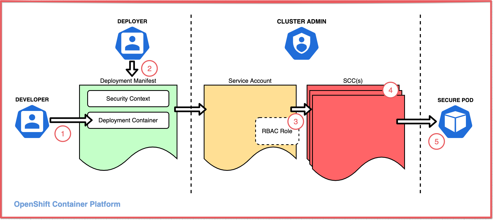
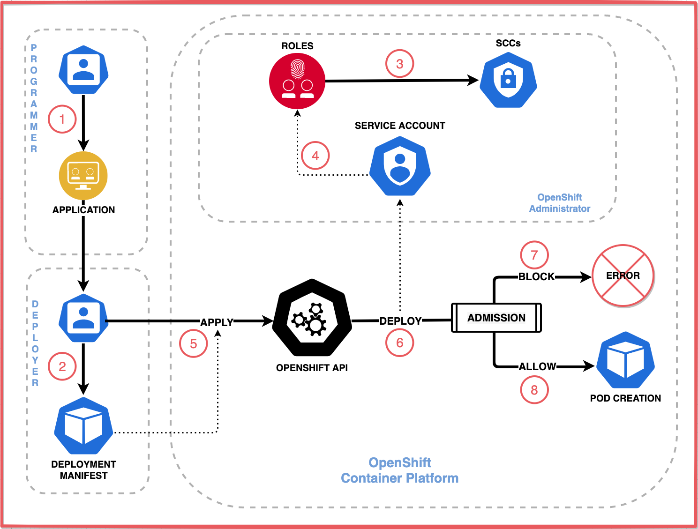

# Red Hat OpenShift security practices using security context contraints - Part I

This article is Part I of a two-part series on Red Hat OpenShift security context constraints (SCC). Here we will focus on why they are needed, and how they can play a key role in providing security on an OpenShift cluster. [Part II](https://github.ibm.com/TT-ISV-org/scc/blob/main/article/details.md) of this article series will dig into the details of how they are implemented and administered.

## Introduction

This article is intended for those interested in maintaining a secure **Red Hat OpenShift** cluster. This includes cluster administrators, who's first priority is to protect and control system resources, and deployers, who may require the use of those same resources.

The specific type of security we will be discussing is controlling permissions for pods. By default, OpenShift blocks containers from accessing protected resources. This protects the cluster and its infrastructure from malicious code running in a container process and thereby makes the cluster more secure.

But what if a developer writes an application that needs to access protected resources?

The focus of this article will be on how this can be accomplished using the security features in OpenShift. We will show how pods can request and receive permission to expand their capabilities and access.

Here is an overview of the process and the resources involved:

1. To enable accessing protected resources, a deployer writes a **deployment manifest** for the pod that specifies:
    * A **security context** (for the pod and/or for each container) requesting the access needed by the application. This includes privileges, access control, and capabilities.
    * A link to a **service account** that the deployer expects to be able to grant this access.
1. For the request to be granted, the cluster administrator must associate the service account with a **security context constraint (SCC)** that grants this access, either directly or typically via an RBAC role.
1. This SCC may be one of OpenShift's predefined SCCs or may be a custom SCC.
1. If the SCC grants the access, the pod deploys successfully.

**IMPORTANT** Note that any deployment manifest which specifies the service account will be granted the permissions in the security context constraints. While the service account can exist cluster-wide, it is usually scoped to a project so that only pods in that cluster can access the SCC. Even then, any deployer in the project can access the service account and the SCC. Therefore, the project and cluster administrators should be selective in choosing the project's deployers.

This article will explain all of these relevant OpenShift features, how they work together to enable pods to request specific access, and how to configure this yourself.

## A pod security use case

One use for SCCs is to specify the user and/or group an application uses to read and write files. This normally isn't an issue when running the application on traditional IT because it always runs as the same user.

But if you deploy that same application on an OpenShift cluster, it typically involves running at scale with multiple pods -- each attempting to read and write to the same file. In this case, the application will fail with file permission errors because each pod is running as a different user (i.e. user 1 can't access files created by user 2).

A common method of solving this issue is to use groups for access control. When a directory is owned by a specific group, it allows access to any user who is a member of that group.

Using that approach, the solution to the problem is to ensure that:

1. The pod sets the directory group to a specific value.
2. All replica pods run using that same group value.

And how do you do that? Since OpenShift won't allow you to do either of these protected actions, you must first ask for permission. On OpenShift, requesting special permissions is accomplished using **SCCs**.

## What is an SCC?

**SCC** stands for Security Content Contraints, and it is the tool provided by OpenShift to control what permissions can be granted to a pod when deployed on a Red Hat OpenShift cluster.

SCCs define what actions the pod is allowed to perform. In the same way that it can prevent a pod from performing any protected actions, it can also agree to allow the pod certain permissions so that it can run successfully.

>**NOTE**: SCCs are implemented using SELinux and AppArmor, both of which are standard kernel security modules included on all Red Hat Linux distributions. The machines in an OpenShift v4.x cluster must run a Red Hat Linux distribution, so those modules will be included.

## How a pod requests additional permissions

In order to perform protected actions, a pod must request "permission" via the deployment manifest - specifically using the **security context** section of the manifest. The manifest is then linked to an SCC, which decides if the requested permissions can be granted.

As a best-practice, SCCs should be developed to be as limiting as possible. Instead of simply (and unsafely) allowing the pod to run as a "privileged" user (e.g. run as "root"), it should attempt to only allow the specific actions that are being requested.

Another way to envision this relationship is to think of the SCC as a lock protecting system resources, and the manifest being the key. The deployment is only successful if the key fits.

Here we show that relationship, in one case against a very restricted SCC, and the other against a custom built SCC.

## The big picture

To better understand how SCCs are used to control access on a Red Hat OpenShift cluster, let's walk-through a common deployment scenario.

First, let's identify the personas that are typically involved in the process of developing an application, configuring a pod to contain the application, and then deploying that application on OpenShift.

* **Programmer** - responsible for developing the application or service that will run in the pod.
* **Deployer** - a user with deployment permissions; responsible for creating the deployment manifest for deploying the application and applying it to the cluster
* **Administrator** - a user with RBAC admin permissions (such as the cluster-admin); ensures the security of the OpenShift cluster by granting access to protected resources only as needed

Administrators use RBAC (role-based access control) resources to control user access. In our scenario, the administrator will create a user  account that has the permission to deploy pods. The **Deployer** can then use that account to create and deploy the pod on OpenShift. The deployer performs this task by creating a **deployment manifest**, which links to the application and provides instructions on how the application should be deployed and ran.

If the application is a typical stateless workload (i.e. requiring no special permissions), the deployer will generate a basic deployment manifest, and the pod will be deployed without any issues.

When more than that is required, the deployer will need to enhance the deployment manifest to request the additional permissions. The associated SCC is then used to determine if the request should be granted.

SCCs are assigned to RBAC subjects (users, groups, or service accounts) and roles. In the deployment manifest, the deployer specifies what **service account** to use, which when deployed associates the deployment with an SCC.

>**NOTE**: an OpenShift service account is a special type of user account that can be used programmatically without using a regular user’s credentials.

If the SCC allows all of the permissions requested by the deployment manifest, the cluster creates and starts the pods.

If the pod is denied the requested permissions, the administrator will need to:

* Determine if the additional requests made in the manifest are in fact needed.
* Determine what SCC will allow the requested permissions, or if none exist, create a new one.
* Assign the SCC to a service account, or a role that includes the service account.

Here is an overview of how user and service accounts, roles, deployment manifiests, and SCCs are involved in the deployment process:

1. The **Programmer** develops an application or service, and ...
1. Delivers the application to the **Deployer**, who creates a deployment manifest for the application.
1. The **Administrator** creates roles which are assigned a security context constraint.
1. The **Administrator** creates a user for the Deployer with a role that provides deployment permissions, and a service account with a role that's assigned one or more SCCs.
1. The **Deployer** logs into OpenShift using the new **OpenShift User Account**, and deploys the application using the deployment manifest. The manifest may contain a request for additional permissions, and may reference which **OpenShift Service Account** to use when deploying the pod.
1. OpenShift processes the manifest and attempts to deploy the pod. The deployment process will compare the permissions requested by the deployment manifest against the permissions allowed by the associated SCCs.
1. If the associated SCC cannot provide all of the permissions the deployment manifest requests, the deployment will fail.
1. Otherwise, the deployment will create the pod and run the application.

## Continue learning

To dig deeper into the details of how SCCs work, check out [Part II](https://github.ibm.com/TT-ISV-org/scc/blob/main/article/details.md) of this article series.

Or check out documentation from Red Hat on [Managing Securuty Context Constraints](https://docs.openshift.com/container-platform/4.7/authentication/managing-security-context-constraints.html).

To get hands-on experience using SCCs, there is a tutorial that was created to accompany this article. It can be found [here](https://github.ibm.com/TT-ISV-org/scc/blob/main/tutorial/index.md).
