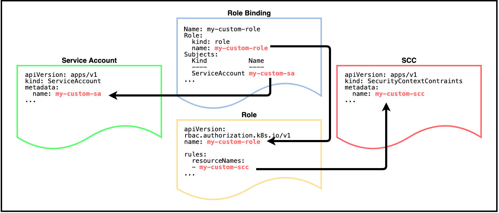

# RBAC discussion

**WORK IN PROGRESS!!!** 

The general idea is to move most/all of the section "Projects and role-based access control (RBAC)") into the new RBAC article.

The RBAC article shouldn't say anything about SCCs, security contexts, etc.
The resulting SCC article(s) should assume the reader knows RBAC. It just shows the RBAC commands that use SCCs and assumes the reader understands. Before it starts showing those commands, it tells the reader that it assumes they know RBAC, for a refresher, see the RBAC article (with a link).
We'll end up with two articles (sets of articles) on security in OCP: RBAC security and SCC security.
Outline for RBAC article (draft):

## OpenShift projects

Any discussion of SCCs needs to be in the context of an OpenShift project namespace, which plays a major role in how SCCs are defined, managed, and utilized.

OpenShift projects are the mechanism to scope resources in a cluster and are used by administrators to limit and isolate resources. These resources include users, deployments, and SCCs.

Here are the important annotation field values:

```yaml
$ oc get project scc-test-project -o yaml 
...
apiVersion: project.openshift.io/v1
kind: Project
metadata:
  name: default
  annotations:
    openshift.io/sa.scc.mcs: s0:c26,c5 
    openshift.io/sa.scc.supplemental-groups: 1000000000/10000
    openshift.io/sa.scc.uid-range: 1000000000/10000
...
```

The `openshift.io/sa.scc` annotations define default values for (in order):

* SELinux options (MCS stands for multi-category security)
* group IDs
* user IDs

These values are only used if the corresponding SCC access control setting is NOT **RunAsAny**, AND when not specified in the SCC or deployment manifest.

>**NOTE**: The range 1000000000/10000 means values between 1000000000 to 1000009999.

## Roles

Let's create a YAML file that describes a new role, and also use a role binding to link to our service account.

```yaml
---
kind: Role
apiVersion: rbac.authorization.k8s.io/v1
metadata:
  name: my-custom-role
rules:
  - apiGroups: ["security.openshift.io"]
    resources: ["securitycontextconstraints"]
    resourceNames: ["my-custom-scc"]
    verbs: ["use"]
---
kind: RoleBinding
apiVersion: rbac.authorization.k8s.io/v1
metadata:
  name: my-custom-rb
subjects:
  - kind: ServiceAccount
    name: my-custom-sa
roleRef:
  kind: Role
  name: my-custom-role
  apiGroup: rbac.authorization.k8s.io
```

Use the following command to create the role and role binding:

```bash
oc create -f my-custom-role.yaml
```

To see the new role and role binding, use the following commands:

```bash
$ oc describe role
...
Name:         my-custom-role
Labels:       <none>
Annotations:  <none>
PolicyRule:
  Resources                                         Resource Names   Verbs
  ---------                                         --------------   -----
  securitycontextconstraints.security.openshift.io  [my-custom-scc]  [use]
```

```bash
$ oc describe rolebinding
...
Name:         my-custom-rb
Labels:       <none>
Annotations:  <none>
Role:
  Kind:  Role
  Name:  my-custom-role
Subjects:
  Kind            Name          Namespace
  ----            ----          ---------
  ServiceAccount  my-custom-sa
```

Note that our custom service account is now associated with our custom role binding, and the role points to our custom SCC.



## Subjects

Subjects can be a users, groups, or service accounts

## Service accounts

Service accounts are basically user accounts, but are more flexible in that you don't have to share a regular user's credentials.

Each service account's user name is derived from its project and name:

```bash
system:serviceaccount:<project>:<name>
```

Use the following command to create a new service account in our current project:

```bash
oc create sa my-custom-sa
```

Get the details for the new service account using the command:

```yaml
$ oc get sa my-custom-sa -o yaml
apiVersion: v1
imagePullSecrets:
- name: my-custom-sa-dockercfg-zgzx9
kind: ServiceAccount
metadata:
  creationTimestamp: "2021-02-16T19:46:00Z"
  name: my-custom-sa
  namespace: scc-test-project
  resourceVersion: "8920053"
  selfLink: /api/v1/namespaces/scc-test-project/serviceaccounts/my-custom-sa
  uid: c915529-897b-4eaa-860b-5b7ec5ae4583
secrets:
- name: my-custom-sa-token-b2p5k
- name: my-custom-sa-dockercfg-zgzx9
```

Once we have our service account created, we can then link it to an SCC. This can accomplished in one of 2 ways:

* Assign SCCs to service accounts directly
* Assign SCCs to service accounts using an RBAC role

## Role Bindings

Move "Role bindings" to here
A role binding connects one role to one-or-more subjects

## Assigning access to features

Need to find some sort of feature that can be assigned access via RBAC (something other than SCCs)

* Can be assigned to users or roles

Need to show that the feature (access to it) can be assigned to a user (or any subject) or to a role

* Works the same
* In a role, it's one of the rules; in a subject, it's
* Assigning a capability to a role is better because it's reused/inherited by all of the role's subjects

Move "How to connect SCCs to service accounts" to here, but revise to show this other feature access

Another appproach is to assign the SCC to an RBAC role, and then bind that role to a service account. This approach is preferred for production environments -- just like assigning permissions to any RBAC role is preferred. Any changes to a role are automatically shared across all subjects.

Let's create a YAML file that describes a new role, and also use a role binding to link to our service account.

```yaml
---
kind: Role
apiVersion: rbac.authorization.k8s.io/v1
metadata:
  name: my-custom-role
rules:
  - apiGroups: ["security.openshift.io"]
    resources: ["securitycontextconstraints"]
    resourceNames: ["my-custom-scc"]
    verbs: ["use"]
---
kind: RoleBinding
apiVersion: rbac.authorization.k8s.io/v1
metadata:
  name: my-custom-rb
subjects:
  - kind: ServiceAccount
    name: my-custom-sa
roleRef:
  kind: Role
  name: my-custom-role
  apiGroup: rbac.authorization.k8s.io
```

Use the following command to create the role and role binding:

```bash
oc create -f my-custom-role.yaml
```

To see the new role and role binding, use the following commands:

```bash
$ oc describe role
...
Name:         my-custom-role
Labels:       <none>
Annotations:  <none>
PolicyRule:
  Resources                                         Resource Names   Verbs
  ---------                                         --------------   -----
  securitycontextconstraints.security.openshift.io  [my-custom-scc]  [use]
```

```bash
$ oc describe rolebinding
...
Name:         my-custom-rb
Labels:       <none>
Annotations:  <none>
Role:
  Kind:  Role
  Name:  my-custom-role
Subjects:
  Kind            Name          Namespace
  ----            ----          ---------
  ServiceAccount  my-custom-sa
```

Note that our custom service account is now associated with our custom role binding, and the role points to our custom SCC.


## Notes

Then in the SCC article, the sections on "Projects and role-based access control (RBAC)" and "How to connect SCCs to service accounts" have been removed. Replace them with an example of assigning SCCs to roles or service accounts that assumes the user already understands RBAC. Show how after it's configured, the YAML for either the role or the SA refers to the SCC by name, but no need for pictures (pictures of how roles/subjects relate to features are now in the RBAC article).

The resulting RBAC article should have nothing about SCCs, and the resulting SCC article should have very little about RBAC--just showing how to assign an SCC to a role or SA, and/or how to create a role with an SCC--because it can assume that the reader already understands RBAC.
