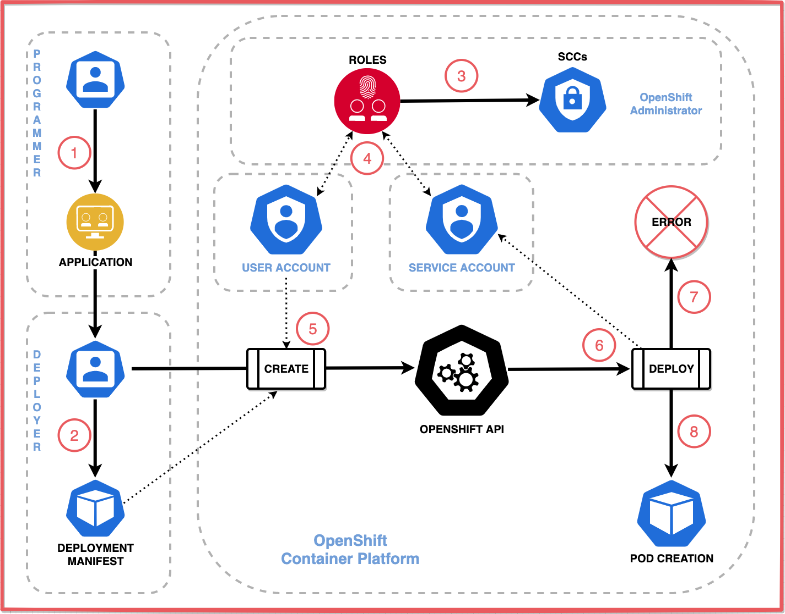
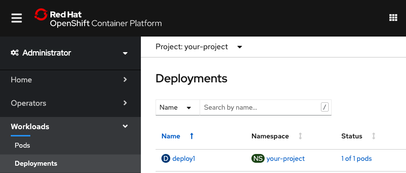
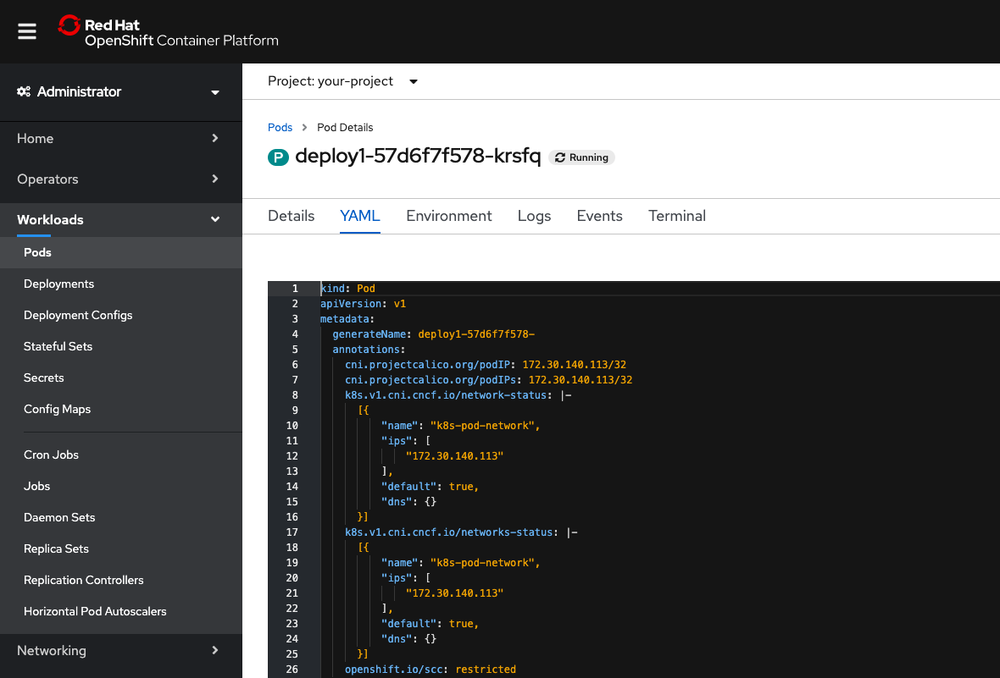
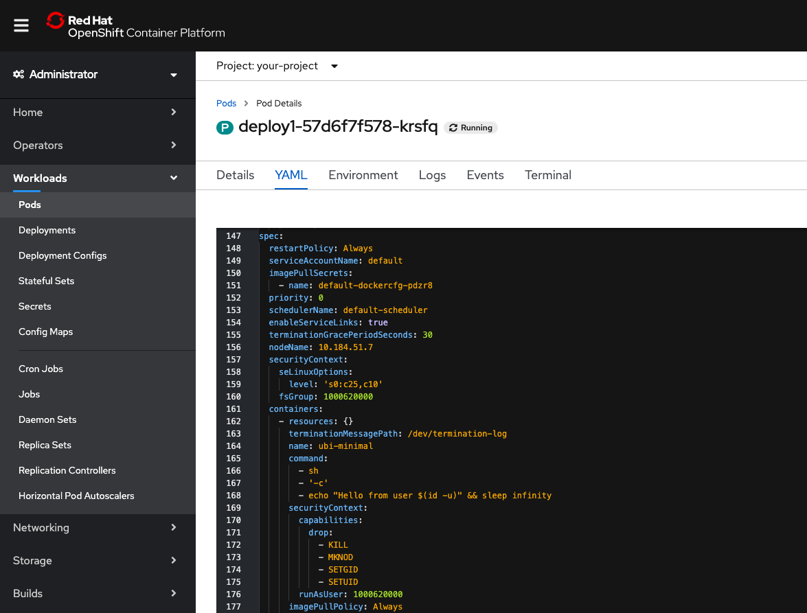
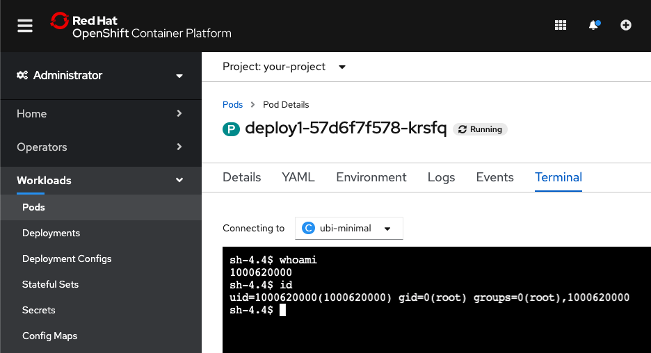
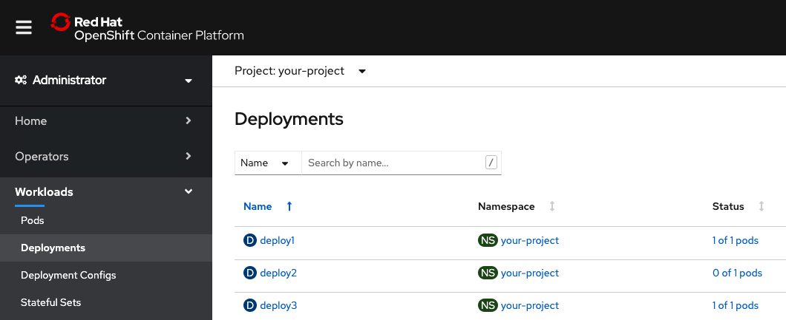
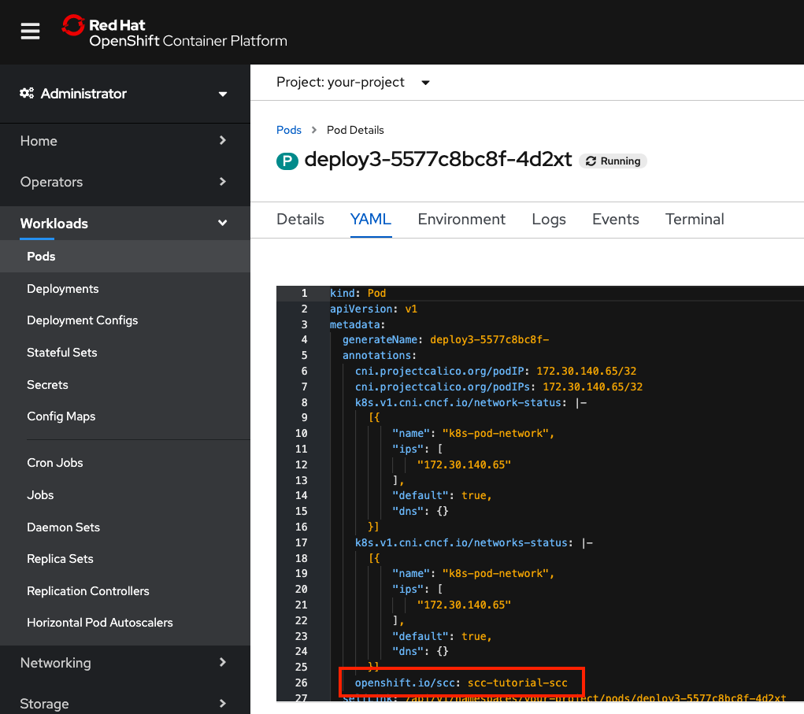
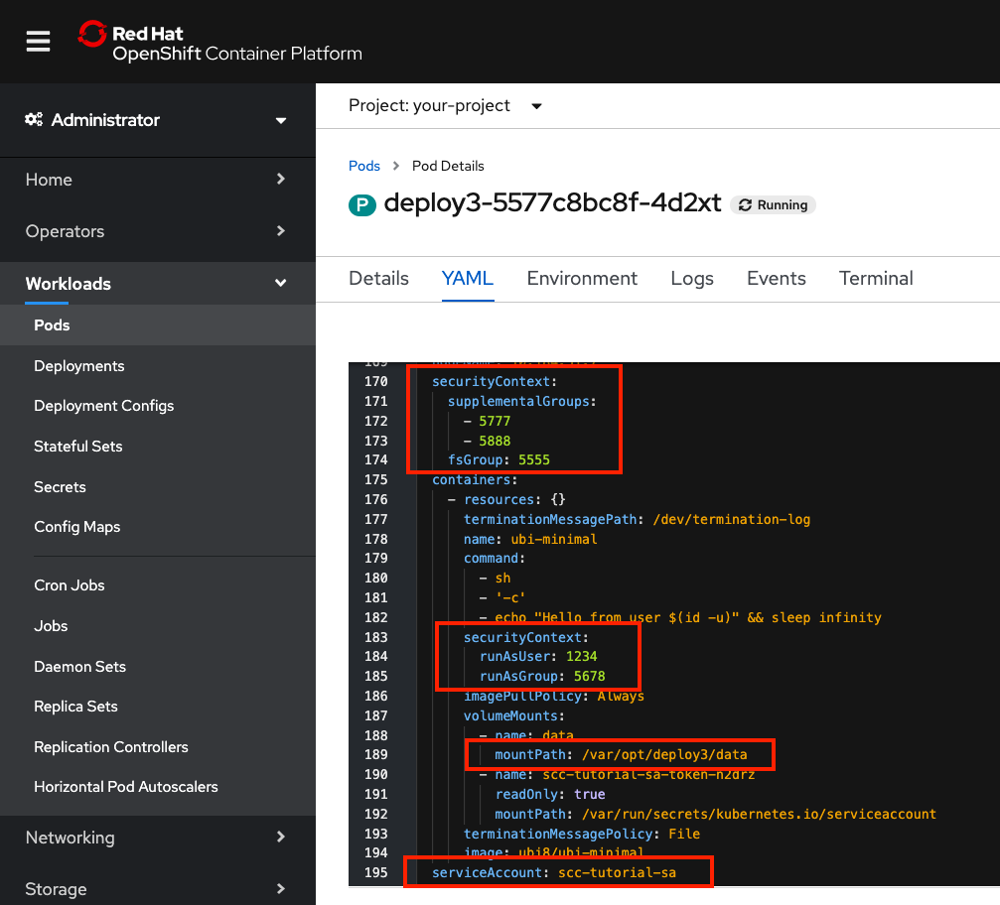
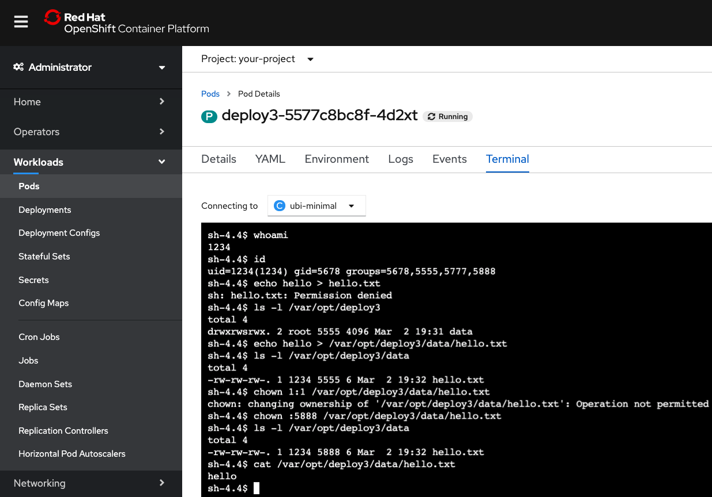

# Use security context constraints to restrict and empower your OpenShift workloads

## Introduction

This hands-on tutorial is intended for developers and cluster administrators who are interested in learning how to deploy workloads on a Red Hat OpenShift cluster in a secure way.

Using security context contraints (SCCs), we'll demonstrate how a workload can be given the least amount of permissions necessary to perform its work. This best practice helps to protect your cluster from both intentional and accidental harm while providing a way to request and grant additional permissions when necessary.

## Concepts

It is recommended that you read the following article to learn the concepts before attempting this hands-on tutorial:

* [Red Hat OpenShift security practices using security context contraints](https://ibm.developer.com/TBD)

The "big picture" concepts from the article are summarized with the following flow diagram.



1. The **Programmer** develops an application or service, and ...
1. Delivers the application to the **Deployer**, who creates a deployment manifest for the application.
1. The **OpenShift Administrator** creates roles which are assigned a security context constraint.
1. The **OpenShift Administrator** creates an **OpenShift User Account** and assigns it a role that provides deployment permissions. Also created is an **OpenShift Service Account** that is associated with one or more SCCs.
1. The **Deployer** logs into OpenShift using the new **OpenShift User Account**, and deploys the application using the deployment manifest. The manifest may contain a request for additional permissions, and may reference which **OpenShift Service Account** to use when deploying the pod.
1. OpenShift processes the manifest and attempts to deploy the pod. The deployment process will compare the permissions requested by the deployment manifest against the permissions allowed by the associated SCCs.
1. If the associated SCC cannot provide all of the permissions the deployment manifest requests, the deployment will fail.
1. Otherwise, the deployment will create the pod and run the application.

## Prerequisites

* Access to an OpenShift cluster
* Cluster admin permission
* Install the OpenShift CLI (oc)
* Open a terminal
* Create and/or switch to a project to work in

## Steps

1. [Create a deployment](#create-a-deployment)
    * Deploy a workload using a Universal Base Image
    * Examine the default security contexts and SCC
    * Test your containers runtime permissions
1. [Attempt to redeploy with security contexts](#attempt-to-redeploy-with-security-contexts)
    * Request special permissions for your deployment
    * See how a deployment fails when requesting permissions that have not been assigned
1. [Create and assign a security context constraint](#create-and-assign-a-security-context-constraint)
    * Create an SCC to allow your deployment's security contexts
    * Create a new service account for your deployment
    * Use role-based access control (RBAC) to assign the SCC to the role
1. [Create the deployment again with the security contexts](#create-the-deployment-again-with-the-security-contexts)
    * Now the deployment can be validated with an SCC
    * Examine the resulting security contexts and selected SCC
    * Test your containers new runtime permissions

## Create a deployment

### Deploy a workload using a Universal Base Image

In this first step, you'll create a minimal deployment. We could start with a smaller unit by simply creating a pod, but a deployment which creates a replica set to manage one or more pods is closer to what a normal workload would look like. With this example, you'll see how your default service account works with a default SCC.

Our example deployment will use a Red Hat Universal Base Image.

1. Start in a terminal.

    * Login with your credentials
    * Switch to the project

    ```bash
    oc login <your-credentials>
    oc project <your-project>
    ```

1. Download the deployment manifest YAML file from [here](static/deploy1.yaml) or copy/paste and save it to a file named deploy1.yaml.

    ```yaml
    apiVersion: apps/v1
    kind: Deployment
    metadata:
      name: deploy1
    spec:
      selector:
        matchLabels:
          app: deploy1
      template:
        metadata:
          labels:
            app: deploy1
        spec:
          containers:
          - image: ubi8/ubi-minimal
            name: ubi-minimal
            command: ['sh', '-c', 'echo "Hello from user $(id -u)" && sleep infinity']
          serviceAccountName: default
          volumes:
          - emptyDir: {}
            name: data
    ```

1. Run the following `oc create` command to create the deployment.

    ```bash
    oc create -f deploy1.yaml
    ```

### Examine the default security contexts and SCC

You can get the full YAML description of the pod to see details. For this tutorial, the interesting part is the annotation that shows what SCC was used, the container securityContext, and the pod securityContext. Also worth noting, is that we used the `default` service account.

You can use the OpenShift Web Console or use `oc` commands in your terminal to see the results.

1. Using `oc` commands:

    To get the details for the pod, use `oc get` with the label `app=deploy1` and the `yaml` output option.

    ```bash
    oc get pod -l app=deploy1 -o yaml
    ```

    Just showing the interesting parts here (explained more in the next section):

    ```yaml
      ...
      metadata:
        annotations:
          ...
          openshift.io/scc: restricted
          ...
      spec:
        containers:
          ...
          securityContext:
            capabilities:
              drop:
              - KILL
              - MKNOD
              - SETGID
              - SETUID
            runAsUser: 1000620000
            ...
        securityContext:
          fsGroup: 1000620000
          seLinuxOptions:
            level: s0:c25,c10
        serviceAccount: default
        serviceAccountName: default
        ...
    ```

1. Using the OpenShift Web Console

    * Check the status of your deployment:

        * Use the sidebar pulldown to select `Administrator`
        * Expand `Workloads`
        * Select `Deployments`
        * `Status` should say `1 of 1 pods`

        

    * Check the details of your pod:

        * Click on the deployment status `1 of 1 pods` link
        * Click on the pod name `deploy1-<generated-suffix>`
        * Select the `YAML` tab

    * Look for the selected SCC:
        * Shown in `annotations`
        * Our default deployment got the `restricted` SCC

        

    * Scroll down to see the pod spec:

        * `ServiceAccountName` is `default`
        * `SecurityContext` for the pod was given `seLinuxOptions` and an `fsGroup` setting.
        * `SecurityContext` for the container was given some specific `capabilities` to `drop` and a `runAsUser`.

        

### Test your container runtime permissions

1. Using `oc` commands:

    * Get the pod name:

        ```bash
        oc get pod -l app=deploy1 
        ```

    * Remote shell into the pod's container:

        ```bash
        oc rsh <pod-name>
        ```

    * Try the following commands:

        ```txt
        whoami
        id
        exit
        ```

    * Example commands with output:

        ```bash
        sh-4.4$ whoami
        1000620000
        sh-4.4$ id
        uid=1000620000(1000620000) gid=0(root) groups=0(root),1000620000
        sh-4.4$ exit
        exit
        ```

1. Using the OpenShift Web Console

    * From the pod details page

        * Select the `Terminal` tab
        * Run the `whoami` and `id` commands
        * Select `Deployments`
        * `Status` should say `1 of 1 pods`

        

1. Consider the results

    * We did not specify any user ID or group ID in our deployment manifest.
    * The user ID (uid) is the one that we saw assigned in the container `securityContext.runAsUser`.
    * This uid has been assigned to the root group (ID 0) and also an additional group which has a group ID that is the same as the uid. This is the `fsGroup` that we saw assigned in the pod `securityContext`.
    * This `fsGroup` is set as the owner of the mounted volume.

## Attempt to redeploy with security contexts

Let's say we are deploying an application where we need to control the user ID and group ID used for data access. It is a common practice to use group IDs for data access.

The first thing we need to do is use security contexts in our deployment manifest to specify the expected user ID and group IDs for our pod and container.

These security contexts are validated against SCCs that are assigned to the service account. If there is not an SCC that can validate the security contexts, then the pod will not be started.

### Request special permissions for your deployment

This YAML will deploy the same application, but this time we are requesting some specific security constraint requirements including to give us our data access control:

* Run as user ID 1234
* Run as group ID 5678
* Use a file system group ID of 5555
* Add supplement group IDs 5777 and 5888

1. Download the deployment manifest YAML file from [here](static/deploy2.yaml) or copy/paste and save it to a file named deploy2.yaml.

    ```yaml
    apiVersion: apps/v1
    kind: Deployment
    metadata:
      name: deploy2
    spec:
      selector:
        matchLabels:
          app: deploy2
      template:
        metadata:
          labels:
            app: deploy2
        spec:
          containers:
          - image: ubi8/ubi-minimal
            name: ubi-minimal
            command: ['sh', '-c', 'echo "Hello from user $(id -u)" && sleep infinity']
            securityContext:
              runAsUser: 1234
              runAsGroup: 5678
            volumeMounts:
            - mountPath: /var/opt/deploy2/data
              name: data
          serviceAccountName: default
          securityContext:
            fsGroup: 5555
            supplementalGroups: [5777, 5888]
          volumes:
          - emptyDir: {}
            name: data
    ```

1. Run the following `oc create` command to create the deployment.

    ```bash
    oc create -f deploy2.yaml
    ```

### See how a deployment fails when requesting privileges that have not been assigned

1. Check for SCC errors

    When a deployment fails due to SCC, you need to check the status of the replica set. Describe the deployment to check replica status:

    ```bash
    oc describe deployment/deploy2
    ```

    The output should show a ReplicaFailure:

    ```bash
    $ oc describe deployment/deploy2
    ...
    Replicas:               1 desired | 0 updated | 0 total | 0 available | 1 unavailable
    ...
    Conditions:
      Type             Status  Reason
      ----             ------  ------
      Available        False   MinimumReplicasUnavailable
      ReplicaFailure   True    FailedCreate
      Progressing      False   ProgressDeadlineExceeded
    OldReplicaSets:    <none>
    NewReplicaSet:     deploy2-75f47b9c99 (0/1 replicas created)
    ...
    ```

    To get a more specific reason for the replica set failure. Use `oc get events`:

    ```bash
    $ oc get events | grep deploy2
    52s         Warning   FailedCreate        replicaset/deploy2-75f47b9c99   Error creating: pods "deploy2-75f47b9c99-" is forbidden: unable to validate against any security context constraint: [fsGroup: Invalid value: []int64{5555}: 5555 is not an allowed group spec.containers[0].securityContext.securityContext.runAsUser: Invalid value: 1234: must be in the ranges: [1000620000, 1000629999]]
    32m         Normal    ScalingReplicaSet   deployment/deploy2              Scaled up replica set deploy2-75f47b9c99 to 1
    ```

    The `FailedCreate` warning clearly shows that we were **unable to validate against any security context constraint** due to our selected fsGroup and runAsUser values.

    We did not fail to "create the deployment". You can use `oc get deployment` or use the OpenShift Web Console to look for it. A deployment named `deploy2` was created. A replica set named `deploy2-<generated-suffix>` was also created. But both show 0-of-1 pods were created, and the replica set has that event that explains the problem.

    These errors are expected because the deployment asked for specific permissions, and the restricted SCC will not allow these permissions. So, instead of deploying an application that will eventually run into data access errors, we made it fail earlier with reasons. Failing early is definitely a good thing. The other thing we accomplished by clearly indicating the special permissions needed by this application, is that we created a way for the developer, the deployer, and the security administrator to better communicate the special security requirements of this deployment.

## Create and assign a security context constraint

> TODO: *** converting to RBAC ***
  * Create an SCC to allow your deployment's security contexts
  * Create a new service account for your deployment
  * Use role-based access control (RBAC) to assign the SCC to the role

You will use security context constraints (SCCs) along with role based access controls (RBAC) to provide your workloads with the privileges they need to perform their work.

> TODO: *** converting to RBAC ***

### Create an SCC to allow your deployment's security contexts

1. Save this YAML to a file named scc-tutorial-scc.yaml

    ```yaml
    kind: SecurityContextConstraints
    apiVersion: v1
    metadata:
      name: scc-tutorial-scc
    allowPrivilegedContainer: false
    runAsUser:
      type: MustRunAsRange 
      uidRangeMin: 1000
      uidRangeMax: 2000
    seLinuxContext:
      type: RunAsAny
    fsGroup:
      type: MustRunAs 
      ranges:
      - min: 5000
        max: 6000
    supplementalGroups:
      type: MustRunAs 
      ranges:
      - min: 5000
        max: 6000
    ```


1. Run the following `oc create` command to create the SecurityContextConstraint.

    ```bash
    oc create -f scc-tutorial-scc.yaml
    ```

1. Use our custom SCC with a service account

    **Instead of modifying the project's default service account**, we'll create a new one and add the SCC to it.  Notice the `-z` in the usage.

    > Usage: oc adm policy add-scc-to-user SCC (USER | -z SERVICEACCOUNT) [USER ...] [flags]

    Run the following commands to create the service account and add our existing SCC to it.

    ```bash
    oc create sa scc-tutorial-sa
    oc adm policy add-scc-to-user scc-tutorial-scc -z scc-tutorial-sa
    ```

> TODO: *** converting to RBAC ***

## Create the deployment again with the security contexts

### Now the deployment can be validated with an SCC

1. Download the deployment manifest YAML file from [here](static/deploy3.yaml) or copy/paste and save it to a file named deploy3.yaml.

    ```yaml
    apiVersion: apps/v1
    kind: Deployment
    metadata:
      name: deploy3
    spec:
      selector:
        matchLabels:
          app: deploy3
      template:
        metadata:
          labels:
            app: deploy3
        spec:
          containers:
          - image: ubi8/ubi-minimal
            name: ubi-minimal
            command: ['sh', '-c', 'echo "Hello from user $(id -u)" && sleep infinity']
            securityContext:
              runAsUser: 1234
              runAsGroup: 5678
            volumeMounts:
            - mountPath: /var/opt/deploy3/data
              name: data
          serviceAccountName: scc-tutorial-sa
          securityContext:
            fsGroup: 5555
            supplementalGroups: [5777, 5888]
          volumes:
          - emptyDir: {}
            name: data
    ```

1. Run the following `oc create` command to create the deployment.

    ```bash
    oc create -f deploy3.yaml
    ```

### Examine after adding custom security contexts and SCC

Now that we've customized the security contexts and created a custom SCC to validate it, let's look at the results.

Use the OpenShift Web Console or use `oc` commands in your terminal to see the results.

1. Using `oc` commands:

    To get the details for the pod, use `oc get` with the label `app=deploy3` and the `yaml` output option.

    ```bash
    oc get pod -l app=deploy3 -o yaml
    ```

    Just showing the interesting parts here (explained more in the next section):

    ```yaml
      ...
      metadata:
        annotations:
          ...
          openshift.io/scc: scc-tutorial-scc
          ...
      spec:
        containers:
          ...
          securityContext:
            runAsGroup: 5678
            runAsUser: 1234
            ...
          volumeMounts:
          - mountPath: /var/opt/deploy3/data
          ...
        securityContext:
          fsGroup: 5555
          supplementalGroups:
          - 5777
          - 5888
        serviceAccount: scc-tutorial-sa
        serviceAccountName: scc-tutorial-sa
        ...
    ```

1. Using the OpenShift Web Console

    * Check the status of your deployment:

        * Use the sidebar pulldown to select `Administrator`
        * Expand `Workloads`
        * Select `Deployments`
        * Find `deploy3`
        * `Status` should say `1 of 1 pods`

        

    * Check the details of your pod:

        * Click on the deployment status `1 of 1 pods` link
        * Click on the pod name `deploy3-<generated-suffix>`
        * Select the `YAML` tab

    * Look for the selected SCC:
        * Shown in `annotations`
        * Our default deployment got our new `scc-tutorial-scc` SCC

        

    * Scroll down to see the pod spec:

        * `SecurityContext` for the pod was given `fsGroup: 5555` and `supplementalGroups: [5777, 5888]`
        * `SecurityContext` for the container was given `runAsUser: 1234` and `runAsGroup: 5678`.
        * The volume was mounted at `/var/opt/deploy3/data`
        * `ServiceAccountName` is `scc-tutorial-sa` (the service account we just created and assigned our one SSC)

        

### Test your container runtime permissions

1. Using `oc` commands:

    * Get the pod name:

        ```bash
        oc get pod -l app=deploy3 
        ```

    * Remote shell into the pod's container:

        ```bash
        oc rsh <pod-name>
        ```

    * Try the following commands:

        ```txt
        whoami
        id
        ls -l /var/opt
        echo hello > hello.txt
        echo hello > /var/opt/deploy3/data/hello.txt
        ls -l /var/opt/deploy3/data/hello.txt
        cat   /var/opt/deploy3/data/hello.txt
        chown 1:1   /var/opt/deploy3/data/hello.txt
        chown :5777   /var/opt/deploy3/data/hello.txt
        exit
        ```

    * Example commands with output:

        ```bash
        sh-4.4$ whoami
        1234
        sh-4.4$ id
        uid=1234(1234) gid=5678 groups=5678,5555,5777,5888
        sh-4.4$ ls -l /var/opt
        total 8
        drwxr-xr-x. 3 root root 4096 Mar  2 17:33 deploy3
        sh-4.4$ echo hello > hello.txt
        sh: hello.txt: Permission denied
        sh-4.4$ echo hello > /var/opt/deploy3/data/hello.txt
        sh-4.4$ ls -l /var/opt/deploy3/data/hello.txt
        -rw-rw-rw-. 1 1234 5555 6 Mar  2 17:58 /var/opt/deploy3/data/hello.txt
        sh-4.4$ cat   /var/opt/deploy3/data/hello.txt
        hello
        sh-4.4$ chown 1:1   /var/opt/deploy3/data/hello.txt
        chown: changing ownership of '/var/opt/deploy3/data/hello.txt': Operation not permitted
        sh-4.4$ chown :5777   /var/opt/deploy3/data/hello.txt
        sh-4.4$ ls -l         /var/opt/deploy3/data/hello.txt
        -rw-rw-rw-. 1 1234 5777 6 Mar  2 17:58 /var/opt/deploy3/data/hello.txt
        sh-4.4$ exit
        exit
        ```

1. Using the OpenShift Web Console

    * From the pod details page

        * Select the `Terminal` tab
        * Run the `whoami` and `id` commands
        * Select `Deployments`
        * `Status` should say `1 of 1 pods`

        

1. Consider the results

    * You are **not** running as root or using the project's default 10 digit user ID range. You could've (should've?) used the project default, but was nice to see we can control this. This just might be the simplest example to prove you can use an SCC.

    * You are running with the gid from `RunAsGroup` and have been added to the `supplementalGroups` and `fsGroup` as well.

    * You cannot write in the root directory. You are not root or a privileged user!

    * The volume was mounted at the path in your spec in a directory owned by `root:5555`. This group ownership came from the `fsGroup` setting.

    * Since you were automatically added to the `fsGroup`, you can write a file to the volume.

    * You tested that you cannot change the file ownership to anything the way a priveleged user could, but for a file owned by you, you can change the group to one of the groups you are assigned to.

## Shared storage use cases

* NFS example
    * Each pod can write to and read from the other pod via the file system
        * Shared storage
        * PersistentVolumeClaim
        * volumeMode: Filesystem
        * 2 pods RWX (same project/namespace)

* Block storage example
    * Write to storage, kill pod, a new pod mounts and reads/writes to the same volume without data loss.
        * 1 pod RWO
        * PersistentVolumeClaim
        * Retain

## Conclusion

### What did we learn?

* We can check the pod YAML, to see what SCC was used.

1. We used a security context to indicate that our deployment is requesting permission to:

    * Run as user ID 1234
    * Run as a group ID 5678
    * Use fsGroup 5555 to allow read/write on a volume
    * Use supplemental groups 5777 and 5888

1. We allowed security context constraint validation to fail using the default service account and restricted SCC.

1. We created an SCC with the permissions we needed.

1. We created a service account and assigned the SCC to it
