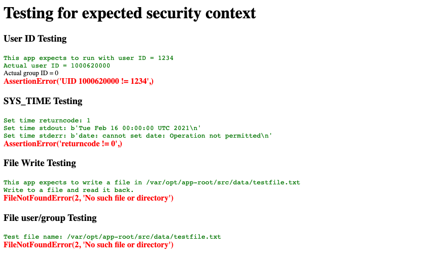

# SCC tutorial (work-in-progress)

> TODO: The official "SCC tutorial" title is TBD

This tutorial will give you hands-on experience using security context controls (SCCs) with OpenShift. A variety of scenarios are used to demonstrate several of the many possibilities. Each scenario is intended to work independently of the others. We recommend trying them (or at least reading them) in order, but you can skip ahead and try the scenario that is most applicable to your use case. After you follow our script, going off-script to experiment and learn on your own is highly encouraged.

## Scenarios

1. [Your first test pod with SCCs](#-Scenario-1:-Your-first-test-pod-with-SCCs)
1. [A deployment with SCCs](#-Scenario-2:-A-deployment-with-SCCs)
1. [User and group access controls with volumes](#-Scenario-3:-User-and-group-access-controls-with-volumes)
1. [Root and/or privileged container mitigation](#-Scenario-4:-Root-and/or-privileged-container-mitigation)
1. [Add/drop Linux capabilities for finer control](#-Scenario-5:-Add/drop-Linux-capabilities-for-finer-control)
1. TODO: SELinux
1. TODO: AppArmor
1. TODO: Seccomp profiles
1. [Shared storage use cases](#-Scenario-6:-Shared-storage-use-cases)
1. [Network access use cases](#-Scenario-7:-Network-access-use-cases)
1. TODO: More...?

## Concepts

Summarize and refer to the article and other links...

## Prerequisites

> TODO: Some of these may need to be explained. Ideally very little...

* Access to an OpenShift cluster
* Admin permissions (more specifics TBD)
* Install the OpenShift CLI (oc)
* Open a terminal
* Create and/or switch to a project to work in

### Conventions

Most of this tutorial will be run from a terminal command-line -- assuming bash or zsh (tested with zsh on MacOS).

We're using the `export` command to set environment variables that will be used in following examples. This allows you to choose names (i.e. a project name and application name) that are different than ours, set them in your environment, and use them in the rest of the commands to avoid copy/pasting the wrong names. Make sure you are always working in a shell where you set them.

We are using YAML templates to allow these environment variables to be set when you run our example commands to create resources. You will copy our YAML to a file and run the `oc process` command. By using templates, we can pass in parameters instead of requiring you to edit the YAML file (e.g. no need to edit a hard-coded project name).

### Start in a terminal

Before running the commands later in this tutorial, use your terminal shell to:

1. Login with your credentials
1. Set your **PROJECT** environment variable
1. Switch to the project

```bash
oc login <your-credentials>
export PROJECT=your-project-name
oc project $PROJECT
```

### Import the Universal Base Image

> TBD: Should we import the image or does this just work if you jump right into the examples?

```bash
oc import-image ubi8/ubi --from=registry.access.redhat.com/ubi8/ubi --confirm
```

## Scenario 1: Your first test pod with SCCs

In this scenario, you will:

1. Create a very, very basic pod
1. Examine its security settings

### Step 1. Create a very, very basic pod

1. Copy this YAML and save it to a file named ubi-pod.yaml (or download it from [here](static/ubi-pod.yaml)).

    Our basic pod will use a Universal Base Image (UBI) from Red Hat. UBI gives us a lightweight Linux container. We're just creating a pod and using a `sleep` command to keep it running.

    ```yaml
    apiVersion: v1
    kind: Pod
    metadata:
      name: ubi-pod
    spec:
      containers:
      - image: ubi8/ubi
        name: container-name
        command: ['sh', '-c', 'echo "Hello universe!" && sleep infinity']
    ```

1. Create the pod by running the following command.

    ```bash
    oc create -f ubi-pod.yaml
    ```

1. Check the status and logs.

    Use the pod name to access the logs and check the status.

    ```bash
    $ oc create -f ubi-pod.yaml
    pod/ubi-pod created
    $ oc logs pod/ubi-pod
    Hello universe!
    $ oc get pod/ubi-pod
    NAME      READY     STATUS    RESTARTS   AGE
    ubi-pod   1/1       Running   0          26s
    $ oc status
    In project your-project on server https://your-url.containers.cloud.ibm.com:31381

    pod/ubi-pod runs ubi8/ubi
    ```
### Step 2. Examine its security settings

You can get the full YAML description of the pod to see details. For this tutorial, the interesting part is the annotation that shows what SCC was used, the container securityContext, and the pod securityContext.

```bash
$ oc get pod/ubi-pod -o yaml
[ ... ]
    openshift.io/scc: anyuid
[ ... ]
    securityContext:
      capabilities:
        drop:
        - MKNOD
[ ... ]
  securityContext:
    seLinuxOptions:
      level: s0:c26,c15
[ ... ]
```

> NOTE: Depending on your cluster privileges, your results might be different. What we are showing here is what you get with a user that is a cluster admin and is allowed to use the `anyuid` SCC.

You can start a remote shell session to see how things look inside the pod.

```bash
oc rsh ubi-pod
```

This puts you in the first container in the pod. In this case, we only had one container.

In your remote shell, try the following commands to see an example of the security you get with typical container.

```bash
whoami
id
echo hello > hellofile
ls -l hellofile
chown 1:1 hellofile
ls -l hellofile
cat hellofile
chown 0:0 hellofile
ls -l hellofile
exit
```

Let's examine the results with our UBI `anyuid` container.

```bash
$ oc rsh ubi-pod
sh-4.4# whoami
root
sh-4.4# id
uid=0(root) gid=0(root) groups=0(root)
sh-4.4# echo hello > hellofile
sh-4.4# ls -l hellofile
-rw-rw-rw-. 1 root root 6 Feb 19 21:21 hellofile
sh-4.4# chown 1:1 hellofile
sh-4.4# ls -l hellofile
-rw-rw-rw-. 1 bin bin 6 Feb 19 21:21 hellofile
sh-4.4# cat hellofile
hello
sh-4.4# chown 0:0 hellofile
sh-4.4# ls -l hellofile
-rw-rw-rw-. 1 root root 6 Feb 19 21:21 hellofile
sh-4.4# exit
exit
```

### What did we learn?

* If allowed, many images will default to run as root.
* We can check the pod YAML, to see what SCC was used.
* Using the `anyuid` SCC, a pod can run as root with minimal constraints.
* A root user can write to a file and change the ownership of files.

### What is wrong with this?

Before going further, we should note that this was an example of **what not to do!**  This tutorial is about security and this example shows a lack of security. If your results were different, that's good! Perhaps your cluster, project, and user are more secure than the example as shown.

### What's next?

The rest of this tutorial is about security context **constraints** (SCCs). SCCs are intended to limit your permissions to create a more secure cluster. We'll show you some wide-open security (bad) practices, but the intent is always to help you learn what to look for and how to use constraints to make your cluster more secure.

It is also notable that creating a pod as a user is not a typical workload. Starting in the next example we'll use deployments and service accounts. The pod/user example is a handy way to try things out, but please continue on to see how deployments and service accounts are used.

## Scenario 2: A deployment with SCCs

In this scenario, you will:

1. Create the test application showing errors due to lack of privileges
    * Ensures you have a working environment
    * Creates the base image that will be used througout the tutorial
    * Provides a baseline to demonstrate the effect of security contexts and security context constraints
1. Attempt to redeploy the application with a security context
    * Demonstrates how an application deployment requesting special privileges in the security context is expected to fail when those privileges are restricted
1. Create and assign a security context constraint
    * Shows how to create an SCC granting special privileges
    * Shows how to add an SCC to a service account
1. Patch the deployment to use your new service account (and SCC!)
    * Proves that restricted capabilities can be added (and dropped)
    * Demonstrates how you can control your runtime user and groups
    * Shows how volume access uses predefined group IDs

> TODO: Probably a "flow diagram" type graphic to introduce this

### Step 1. Create the test application showing errors due to lack of privileges

#### Creating the demo app with `oc new-app`

Run the following commands to build an image from our git repo and deploy the demo app. The app is a simple Python app that we will use in this tutorial.

```bash
oc new-app https://github.com/markstur/scc-tutorial --context-dir=mod-wsgi-test-app --name=scc-python --image-stream="openshift/python:latest"
```

> NOTE: Add the *--as-test=true* option if you'd prefer to skip the deployment of the app. That will build the image we need in the later examples where we use a security context and you can skip ahead without these baseline results.

This command results in:

1. Building and image from the GitHub source and creating an image stream in our OpenShift image registry.
2. Deploying a pod which runs the application in a container.
3. Creating a service named **scc-tutorial-assets**.

#### Exposing a route

To create a route based on the service so that you can try the app, run:

```bash
oc expose svc/scc-python
```

Use the following command to get the HOST/PORT to access the application's web page:

```bash
oc get route/scc-python
```

#### Using the application

The application is a Python WSGI Flask application. It uses a minimal amount of code to run some tests and report the results on its default web page. It also logs the results, so you can check the service logs or pod logs.

This application will run successfully with an empty security context, but it will log errors when you hit the web page. Ideally the application would like to:

* Run as a specific user ID
* Run as a specific group ID
* Mount a volume at path /var/opt/app-root/src/data
* Use a specific group ID to allow read/write on the volume
* Change the system clock
* Use setuid to run a program as another user
* Test and log the results of all of the above

After you hit the web page URL, you can also check the pod logs with the following command:

```bash
oc logs svc/scc-python
```

If you prefer to use the web console:


1. Use the pulldown on the left to select the `Developer` view.
1. Click on `Topology`.
1. Click on the application named `scc-python`. The right sidebar will slide out. It shows you how to `View logs` for the pods and provides a link for the service route.
1. Click on the route link.
    * TIP: There is an `Open URL` glyph attached to the application on the Topology canvas that you can also use to browse to the route.
1. Go back to the sidebar and click on `View logs` to see where an app would really show you warnings, errors, and info.

#### What to expect

You should have successfully deployed an application from our source code, exposed a public service route, browsed to its web page, and found the pod logs.

By default, OpenShift runs this application using the **default** service account with the **restricted** SCC. If your cluster/project has different defaults, your results might be different. That's okay, we'll use a new service account and CSS later in the tutorial.

We did not add a volume or any special privileges. So expect to see red errors on the web page and the same errors in the log. In the following sections we'll see how SCCs work and fix those errors.



If you view the pod log, you'll see that the *ERROR* and *INFO* messages are written to the log every time you hit the web page.


### Step 2. Attempt to redeploy the application with a security context

Since the application is intended to run with a specific user ID and other restricted capabilities, we really should use a `securityContext` to request those capabilities.

This YAML will deploy the same application, but this time we are requesting some specific security constraint requirements including:

* Run as user 1234
* Create a file system group ID of 5678
* Add capabilities: CHOWN and SETGID
* Drop capabilities: SETUID, KILL, MKNOD

#### Deploying the application with security context settings

1. Copy (or download) this scc-template.yaml file.

    ```yaml
    kind: Template
    apiVersion: v1
    metadata:
      name: ${APP}-template
    objects:
    - kind: Deployment
      apiVersion: apps/v1
      metadata:
        name: ${APP}
      spec:
        selector:
          matchLabels:
            app: ${APP}
        template:
          metadata:
            labels:
              app: ${APP}
          spec:
            containers:
            - image: image-registry.openshift-image-registry.svc:5000/${PROJECT}/scc-python:latest
              name: ${APP}-container
              ports:
              - containerPort: 8080
                protocol: TCP
              resources: {}
              securityContext:
                capabilities:
                  add:
                  - SYS_TIME
                  - SETUID
                  - SETGID
                  drop:
                  - KILL
                  - MKNOD
                privileged: true
                runAsUser: 1234
              volumeMounts:
              - mountPath: /var/opt/app-root/src/data
                name: ${APP}-data
            securityContext:
              fsGroup: 5678
            volumes:
            - emptyDir: {}
              name: ${APP}-data
    parameters:
      - name: APP
      - name: PROJECT
    ```

1. Process the template with APP and PROJECT parameters and create the deployment

    Set a new APP name for your app. Make sure your PROJECT is also set in your shell.

    ```bash
    export APP=<your-app-name>
    export PROJECT=<your-app-name>
    ```

    Process the template using APP and PROJECT parameters and create the deployment:

    ```bash
    oc process -f  scc-template.yaml -pAPP=$APP -pPROJECT=$PROJECT | oc create -f -
    ```

1. Check for SCC errors

    When a deployment fails due to SCC, you need to check the status of the replica set. Describe the deployment to check replica status:

    ```bash
    oc describe deployment/$APP
    ```

    The output should show a ReplicaFailure:

    ```bash
    $ oc describe deployment/$APP
    [ ... ]
    Replicas:               1 desired | 0 updated | 0 total | 0 available | 1 unavailable
    [ ... ]
    Conditions:
      Type             Status  Reason
      ----             ------  ------
      Progressing      True    NewReplicaSetCreated
      Available        False   MinimumReplicasUnavailable
      ReplicaFailure   True    FailedCreate
    OldReplicaSets:    <none>
    NewReplicaSet:     your-app-6fc6889db7 (0/1 replicas created)
    Events:
      Type    Reason             Age   From                   Message
      ----    ------             ----  ----                   -------
      Normal  ScalingReplicaSet  11s   deployment-controller  Scaled up replica set your-app-6fc6889db7 to 1
    ```

    To get a more specific reason for the replica set failure. Use `oc get events`:

    ```bash
    $ oc get events | grep $APP
    107s        Warning   FailedCreate        replicaset/your-app-6fc6889db7       Error creating: pods "your-app-6fc6889db7-" is forbidden: unable to validate against any security context constraint: [fsGroup: Invalid value: []int64{5678}: 5678 is not an allowed group spec.containers[0].securityContext.securityContext.runAsUser: Invalid value: 1234: must be in the ranges: [1000620000, 1000629999] spec.containers[0].securityContext.privileged: Invalid value: true: Privileged containers are not allowed capabilities.add: Invalid value: "SETGID": capability may not be added capabilities.add: Invalid value: "SETUID": capability may not be added capabilities.add: Invalid value: "SYS_TIME": capability may not be added]
    [...]
    ```

    The `FailedCreate` warning clearly shows that we got **security context constraint** validation errors.

    We did not fail to create the deployment, we failed when the replica set tried to validate the security constraints and create the pod. The replica set uses a service account and the default service account uses the restricted SCC.

    These errors are expected because the deployment asked for specific permissions, and the restricted SCC will not allow these permissions. So, instead of deploying an application that will produce errors, we made it fail earlier with reasons. Failing early is definitely a good thing. The other thing we accomplished by clearly indicating the special permissions needed by this application, is that we created a way for the developer, the deployer, and the security administrator to communicate better.

    Don't delete this deployment. We'll fix this in the next section.

### Step 3. Create and assign a security context constraint

#### Create our SCC with the capabilities we will need

1. Save this YAML to a file named scc-tutorial-scc.yaml.

    ```yaml
    kind: SecurityContextConstraints
    apiVersion: v1
    metadata:
      name: scc-tutorial-scc
    allowPrivilegedContainer: true
    runAsUser:
      type: MustRunAsRange 
      uidRangeMin: 1000
      uidRangeMax: 2000
    seLinuxContext:
      type: RunAsAny
    fsGroup:
      type: MustRunAs 
      ranges:
      - min: 5000
        max: 6000
    supplementalGroups:
      type: MustRunAs 
      ranges:
      - min: 5000
        max: 6000
    defaultAddCapabilities:
    - SYS_TIME
    - SETGID
    - SETUID
    requiredDropCapabilities:
    - KILL
    - MKNOD
    ```

1. Run the following `oc create` command to create the SecurityContextConstraint.

    Create the SecurityContextContraint

    ```bash
    oc create -f scc-tutorial-scc.yaml
    ```

1. Use our custom SCC with a service account

    **Instead of modifying the project's default service account**, we'll create a new one and add the SCC to it.  Notice the `-z` in the usage.

    > Usage: oc adm policy add-scc-to-user SCC (USER | -z SERVICEACCOUNT) [USER ...] [flags]

    Run the following commands to create the service account and add our existing SCC to it.

    ```bash
    oc create sa scc-tutorial-sa
    oc adm policy add-scc-to-user scc-tutorial-scc -z scc-tutorial-sa
    ```

### Step 4: Patch the deployment to use your new SCC

1. Patch the deployment to use our new custom service account with the following command:

    ```bash
    oc patch deployment/$APP --patch '{"spec":{"template":{"spec":{"serviceAccountName": "scc-tutorial-sa"}}}}'
    ```

    Now replication set should successfully spin up a pod running the application.

1. Run the following commands to give your application a service and a route.

    ```bash
    oc expose deployment/$APP
    oc expose svc/$APP
    ```

1. Hit your new application's web page and see the results.

    

### What did we learn?

1. We used a security context to indicate that our application is requesting permission to:

    * Run as user ID 1234
    * Run as "privileged" to allow changing the system clock!!!
    * Use fsGroup 5678 to allow read/write on a volume
    * Use supplemental group 5656 and test changing the file ownership
    <!-- 
    * Run as a group ID 5678
    * Use setuid to run a program as another user
    -->

1. We allowed security context constraint validation to fail using the default service account and restricted SCC.

1. We created an SCC with the permissions we needed.

1. We created a service account and assigned the SCC to it

1. We patched our deployment to use this service account.

1. This fixed the application to allow it to run.

1. We hit its test page, and instead of getting errors, it passed all its tests.

## Deleting resources

> TODO: help clean up

## Scenario 4: Root and/or privileged container mitigation

In this scenario, we'll learn how to run a container as root, as a privileged non-root user, and as regular user.

We'll be creating a *Deployment* which has template describing the desired pod/container specs. With a *Deployment* a *Replica Set* is created to validate the security contexts, start the pod(s) using a service account, and keep the desired number of pod instances running.

### Step 1. Non-privileged user

Since the application is intended to run with a specific user ID and other restricted capabilities, we really should use a `securityContext` to request those capabilities.

This YAML will deploy the same application, but this time we are requesting some specific security constraint requirements including:

* Run as user 1234
* Create a file system group ID of 5678
* Add capabilities: CHOWN and SETGID
* Drop capabilities: SETUID, KILL, MKNOD

#### Deploying the application with security context settings

1. Copy (or download) this scc-template.yaml file.

```yaml
apiVersion: v1
kind: Pod
metadata:
  name: ubi-privs
spec:
  containers:
  - image: ubi8/ubi
    name: priv-0
    command: ['sh', '-c', 'echo "Hello from user $(user -u) privileged!!" && sleep infinity']
    securityContext:
      runAsUser: 0
      privileged: true
  - image: ubi8/ubi
    name: priv-1234
    command: ['sh', '-c', 'echo "Hello from user $(user -u) privileged!!" && sleep infinity']
    securityContext:
      runAsUser: 1234
      privileged: true
  - image: ubi8/ubi
    name: non-priv-0
    command: ['sh', '-c', 'echo "Hello from user $(user -u) non-privileged!!" && sleep infinity']
    securityContext:
      runAsUser: 0
      privileged: false
  - image: ubi8/ubi
    name: non-priv-1234
    command: ['sh', '-c', 'echo "Hello from user $(user -u) non-privileged!!" && sleep infinity']
    securityContext:
      runAsUser: 1234
      privileged: false
```

## Scenario 5: Add/drop Linux capabilities for finer control

In this scenario, you will:

1. Create a user and SCC that only allows specific Linux capabilities
1. Create 2 pods with fine-grained capability constraints
    * One can change file ownership
    * One that **cannot** change file ownership
1. Examine their security settings
1. Demonstrate allowed and limited capabilities


### Step 1: Create a root pod that cannot chown

Copy this YAML and save it to a file named ubi-cap.yaml (or download it from [here](static/ubi-pod.yaml)).

```yaml
apiVersion: v1
kind: Pod
metadata:
  name: ubi-cap
  namespace: your-project
spec:
  containers:
  - image: ubi8/ubi
    name: flask-cap
    command: ['sh', '-c', 'echo "Hello from user $(id -u) privileged" && sleep infinity']
    securityContext:
      capabilities:
        drop:
          - NET_RAW
          - CHOWN
```

```yaml
apiVersion: v1
kind: Pod
metadata:
  name: ubi-cap2
  namespace: your-project
spec:
  containers:
  - image: ubi8/ubi
    name: flask-cap
    command: ['sh', '-c', 'echo "Hello from user $(id -u) privileged" && sleep infinity']
    securityContext:
      capabilities:
        drop:
          - NET_RAW
```

Before going further, we should note that this was an example of **what not to do!**  This tutorial is about security and this example shows a lack of security. If your results were different, that's good. Perhaps your cluster and user are more locked-down.

The rest of this tutorial is about security context **constraints** (SCCs). SCCs are meant to limit your permissions to create a more secure cluster.

## Scenario 6: Shared storage use cases

* NFS example
    * Shared storage
    * volumeMode: Filesystem
    * 2 pods RWX (same project/namespace)
    * Each pod can write to and read from the other pod via the file system

* Block storage example
    * 1 pod RWO
    * Retain
    * Write to storage, kill pod, a new pod mounts and reads/writes to the same volume without data loss.

## Scenario 7: Network access use cases

In many cases, containers that require network access (beyond the typical cloud native web app ingress/egress) will likely expect to run as root or privileged. In this use case, we'll demonstrate how to follow the principle of least privilege and use an SCC to provide a minimal Linux capability while denying root or a fully privileged container.

A common example is the ability to use `ping`. While it might seem like a very harmless capability, the use of ping includes the capability to craft raw packets and this is considered a security risk. This capability is **NET_RAW** in our security context. One example of an application that would merit allowing this capability is a system monitoring application. If your enterprise relies on an application which uses ping to track system availability, then you need to provide this capability to the mission-critical trusted application. With the following steps, you will demonstrate how to privide the ability to use ping without using root or a privileged container (only NET_RAW).

Another common example, is the ability to listen to privileged ports. A web server typically listens to port 80 and 443 which are privileged. Ideally you would configure your web server to work better with the usual assigned ports, but in case your organization requires the use of privilged ports, you would want to provide this capability with **NET_BIND** while not allowing root or a fully privileged container. Again, always follow the principle of least privilege to minimize your security risk.

### Step 1. Create the pods

1. Copy this YAML and save it to a file named alpine_pod.yaml (or download it from [here](todo)).

    Our basic pod will use an Alpine Linux container from Docker Hub. Alpine Linux is a tiny, minimal Linux distribution. So it is a great way to get started. You can try substituting your favorite Linux image. We're just creating a pod and using a `sleep` command to keep it running.

    ```yaml
    apiVersion: v1
    kind: Pod
    metadata:
      name: alpine-pod-drops
    spec:
      containers:
      - image: alpine:3.13
        name: drops
        command: ['sh', '-c', 'echo "Hello CAP DROPS!" && sleep infinity']
        securityContext:
          capabilities:
            drop:
              - NET_RAW
              - CHOWN
      - image: alpine:3.13
        name: adds
        command: ['sh', '-c', 'echo "Hello CAP ADDS!" && sleep infinity']
        securityContext:
          capabilities:
            add:
              - NET_RAW
              - CHOWN
    ```

1. Create the pod by running the following command.

    ```bash
    oc create -f alpine_pod.yaml
    ```

1. Check the status and logs.

    Use the pod name to access the logs and check the status.

    ```bash
    $ oc logs pod/alpine-pod
    Hello world!
    $ oc get pod/alpine-pod
    NAME         READY     STATUS    RESTARTS   AGE
    alpine-pod   1/1       Running   0          5m
    $ oc status
    In project your-project on server https://your-url.us-south.containers.cloud.ibm.com:31381

    pod/alpine-pod runs alpine:3.13

    1 info identified, use 'oc status --suggest' to see details.
    ```

### Step 2. Examine its security settings

You can get the full YAML description of the pod to see details. For this tutorial, the interesting part is the annotation that shows what SCC was used, the container securityContext, and the pod securityContext.

```bash
$ oc get pod/alpine-pod -o yaml
[ ... ]
    openshift.io/scc: anyuid
[ ... ]
    securityContext:
      capabilities:
        drop:
        - MKNOD
[ ... ]
  securityContext:
    seLinuxOptions:
      level: s0:c26,c15
[ ... ]
```

> NOTE: Depending on your cluster privileges, your results might be different. What we are showing here is what you get with a user that is a project admin and is allowed to use the `anyuid` SCC.

You can start a remote shell session to see how things look inside the pod.

```bash
oc rsh alpine-pod
```

This puts you in the first container in the pod. In this case, we only had one container.

In your remote shell, try the following commands to see an example of the security you get with typical container.

```bash
whoami
id
touch testfile
ls -l testfile
chown 1:1 testfile
ls -l testfile
echo $(hostname)
ping -c3 $(hostname)
ping -c3 example.com
exit
```

Let's examine the results with our basic Alpine `anyuid` container.

> TODO: thinking this could be an annotated screenshot from console

```bash
$ oc rsh alpine-pod
/ # whoami
root
/ # id
uid=0(root) gid=0(root) groups=0(root),1(bin),2(daemon),3(sys),4(adm),6(disk),10(wheel),11(floppy),20(dialout),26(tape),27(video)
/ # touch testfile
/ # ls -l testfile
-rw-rw-rw-    1 root     root             0 Feb 18 01:55 testfile
/ # chown 1:1 testfile
/ # ls -l testfile
-rw-rw-rw-    1 bin      bin              0 Feb 18 01:55 testfile
/ # echo $(hostname)
alpine-pod
/ # ping -c 3 example.com
PING example.com (93.184.216.34): 56 data bytes
64 bytes from 93.184.216.34: seq=0 ttl=56 time=7.620 ms
64 bytes from 93.184.216.34: seq=1 ttl=56 time=1.026 ms
64 bytes from 93.184.216.34: seq=2 ttl=56 time=1.743 ms

--- example.com ping statistics ---
3 packets transmitted, 3 packets received, 0% packet loss
round-trip min/avg/max = 1.026/3.463/7.620 ms
/ # ping -c3 $(hostname)
PING alpine-pod (172.30.140.50): 56 data bytes
64 bytes from 172.30.140.50: seq=0 ttl=64 time=0.120 ms
64 bytes from 172.30.140.50: seq=1 ttl=64 time=0.085 ms
64 bytes from 172.30.140.50: seq=2 ttl=64 time=0.126 ms

--- alpine-pod ping statistics ---
3 packets transmitted, 3 packets received, 0% packet loss
round-trip min/avg/max = 0.085/0.110/0.126 ms
/ # exit
```

### What did we learn?

* If allowed, many images will default to run as root.
* We can check the pod YAML, to see what SCC was used.
* Using the `anyuid` SCC, a pod can run as root with minimal constraints.
* A root user can write to a file, change the ownership of the file, ping inside the pod, and ping outside the pod.
