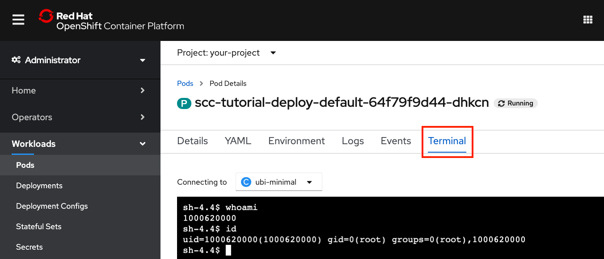
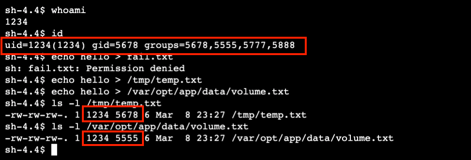

# Use security context constraints to restrict and empower your OpenShift workloads

## Introduction

This hands-on tutorial is intended for developers and cluster administrators who are interested in learning how to deploy workloads on a Red Hat OpenShift cluster in a secure way.

Using security context contraints (SCCs), you'll learn how to give a workload the least amount of permissions necessary to perform its work. This best practice helps to protect your cluster from both intentional and accidental harm while providing a way to request and grant additional permissions when necessary.

In this tutorial, you will create a simple deployment. Deployments rollout replica sets which bring up pods as requested in a spec. This tutorial starts with a simple pod that mounts a temporary volume and runs a single container. We can use a remote shell to run commands on the container to examine its runtime environment and permissions.

You will learn how to:

* Check the pod YAML, to see what SCC and security context it was assigned
* Test access permissions using a default service account and default security context
* Find an error event that shows a security context constraint validation error
* Create an SCC and assign it to a service account
* Use a security context with an SCC to control file access on a volume

## Concepts

It is recommended that you read the following article to learn the concepts before attempting this hands-on tutorial:

* [Red Hat OpenShift security practices using security context contraints](https://ibm.developer.com/TBD)

The "big picture" concepts from the article are summarized with the following flow diagram.


1. The **Programmer** develops an application or service, and ...
1. Delivers the application to the **Deployer**, who creates a deployment manifest for the application.
1. The **OpenShift Administrator** creates roles which are assigned a security context constraint.
1. The **OpenShift Administrator** creates an **OpenShift User Account** and assigns it a role that provides deployment permissions. Also created is an **OpenShift Service Account** that is associated with one or more SCCs.
1. The **Deployer** logs into OpenShift using the new **OpenShift User Account**, and deploys the application using the deployment manifest. The manifest may contain a request for additional permissions, and may reference which **OpenShift Service Account** to use when deploying the pod.
1. OpenShift processes the manifest and attempts to deploy the pod. The deployment process will compare the permissions requested by the deployment manifest against the permissions allowed by the associated SCCs.
1. If the associated SCC cannot provide all of the permissions the deployment manifest requests, the deployment will fail.
1. Otherwise, the deployment will create the pod and run the application.

## Use cases

Our example use case is focused on demonstrating and learning. You will be controlling a container's runtime user ID and group ID and the pod's file system group ID and supplemental groups. By running a Universal Base Image and mounting an EmptyDir volume, you won't see a full-stack application, but it is easy to run some commands on the container to see what the environment looks like and test the privileges and access controls on the ephemeral mounted volume.

Beyond our goal of hands-on learning, here's how our example relates to real world workloads:

1. Accessing shared storage

    * A very common use case is a container that needs to access shared storage. A best practice is to add the group ID of the shared storage to the supplemental groups for the pod. Each container will become a member of these groups and will have access to the storage. This is generally easier to manage than permissions based on user IDs. A file system group ID (fsGroup) is a similar concept. The file system group ID is used when mounting block storage and is also added to the containers' supplemental groups. Our example deployment demonstrates both fsGroup and supplmental groups (and a mounted ephemeral volume).

1. Forcing a user ID and/or group ID

   * Another common use case is any container that just won't work without a specific user or group. Although it would be nice to fix the container to work with the project-assigned UID/GID, if necessary you can specify a runAsUser and/or runAsGroup in the security context and then use SCCs to allow and validate. Our example does this. Changing the runAsUser also happens to be one of the easier experiments to try as you are learning.
   
1. Privileged containers and capabilities

    * Lastly, there are many example of containers that need to run as root, or as a privileged user. This is something for a Deployer to request and for a cluster administrator to restrict (to protect against vulnerabilities or abuse). Although the tutorial avoids requesting these privileges, you will learn the tools to request and grant privileges. Fortunately, fine-grained capabilities can be requested instead of full privileges when you use security contexts and SCCs.

## Prerequisites

* Access to an OpenShift cluster
* Cluster admin permission
* The OpenShift CLI (oc)
* A bash or zsh terminal (or similar)
* An OpenShift project to work in

## Steps

1. [Create a default deployment](#create-a-default-deployment)
    * Deploy a workload using a Universal Base Image
    * Examine the default security contexts and SCC
    * Test your container's runtime permissions
1. [Attempt a deployment with security contexts](#attempt-a-deployment-with-security-contexts)
    * Request special permissions for your deployment
    * See how a deployment fails when requesting permissions that have not been assigned
1. [Create and assign a security context constraint](#create-and-assign-a-security-context-constraint)
    * Create an SCC to allow your deployment's security contexts
    * Create a role that can use the SCC
    * Bind the role to a service account
1. [Create a deployment using the service account that can use the SCC](#create-a-deployment-using-the-service-account-that-can-use-the-SCC)
    * Now the deployment can be validated with an SCC
    * Examine the resulting security contexts and selected SCC
    * Test your container's new runtime permissions

### Personas

Steps 1, 2, and 4 are performed by a user with permission to create deployments (the Deployer). The Deployer is responsible for specifying security contexts to request the permissions required by the pod and container. The Deployer can also select the service account that will be used to validate the requested permissions.

Step 3 is performed by a cluster admin. Creating and assigning SCCs can be done to restrict permissions, but it can also relax permissions and create vulnerabilities. Because of this, it is up to the cluster admin to determine which SCCs should be allowed in the cluster and when to assign them to project service accounts.

> WARNING: Once privileges have been given to an SCC and the SCC has been granted to a project service account (e.g. via a role binding), any Deployer in the project can take advantage of those privileges.

## Create a default deployment

### Deploy a workload using a Universal Base Image

In this first step, you'll create a minimal deployment. We could start with a smaller unit by simply creating a pod, but a deployment which creates a replica set to manage one or more pods is closer to what a normal workload would look like. With this example, you'll see how your default service account works with a default SCC.

Our example deployment will use a Red Hat Universal Base Image.

1. Start in a terminal.

    * Login with your credentials
    * Switch to the project

    ```bash
    oc login <your-credentials>
    oc project <your-project>
    ```

1. Download the deployment manifest YAML file from [here](static/deploy_default.yaml) or copy/paste and save it to a file named deploy_default.yaml.

    ```yaml
    apiVersion: apps/v1
    kind: Deployment
    metadata:
      name: scc-tutorial-deploy-default
    spec:
      selector:
        matchLabels:
          app: scc-tutorial-default
      template:
        metadata:
          labels:
            app: scc-tutorial-default
        spec:
          containers:
          - image: ubi8/ubi-minimal
            name: ubi-minimal
            command: ['sh', '-c', 'echo "Hello from user $(id -u)" && sleep infinity']
            volumeMounts:
            - mountPath: /var/opt/app/data
              name: data
          serviceAccountName: default
          volumes:
          - emptyDir: {}
            name: data

    ```

1. Run the following command to create the deployment.

    ```bash
    oc create -f deploy_default.yaml
    ```

### Examine the default security contexts and SCC

You can get the full YAML description of the pod to see details. For this tutorial, the interesting part is the annotation that shows what SCC was used, the container securityContext, and the pod securityContext. Also worth noting, is that we used the `default` service account.

You can use the OpenShift Web Console or use `oc` commands in your terminal to see the results.

1. Using `oc` commands:

    To get the details for the pod, use `oc get` with the label `app=scc-tutorial-default` and the `yaml` output option.

    ```bash
    oc get pod -l app=scc-tutorial-default -o yaml
    ```

    Just showing the interesting parts here (explained more in the next section):

    ```yaml
      ...
      metadata:
        annotations:
          ...
          openshift.io/scc: restricted
          ...
      spec:
        containers:
          ...
          securityContext:
            capabilities:
              drop:
              - KILL
              - MKNOD
              - SETGID
              - SETUID
            runAsUser: 1000620000
            ...
        securityContext:
          fsGroup: 1000620000
          seLinuxOptions:
            level: s0:c25,c10
        serviceAccount: default
        serviceAccountName: default
        ...
    ```

1. Using the OpenShift Web Console

    * Check the status of your deployment:

        * Use the sidebar pulldown to select `Administrator`
        * Expand `Workloads`
        * Select `Deployments`
        * `Status` should say `1 of 1 pods`

        

    * Check the details of your pod:

        * Click on the deployment status `1 of 1 pods` link
        * Click on the pod name `scc-tutorial-deploy-default-<generated-suffix>`
        * Select the `YAML` tab

        

    * Look for the selected SCC:
        * Shown in `annotations`
        * Our default deployment got the `restricted` SCC

        

    * Scroll down to see the pod spec:

        * `ServiceAccountName` is `default`
        * `SecurityContext` for the pod was given `seLinuxOptions` and an `fsGroup` setting.
        * `SecurityContext` for the container was given some specific `capabilities` to `drop` and a `runAsUser`.

        

### Test your container runtime permissions

1. Use an interactive shell with `oc` or in the web console

    * Using `oc` commands

      * Get the pod name:

        ```bash
        oc get pod -l app=scc-tutorial-default 
        ```

      * Remote shell into the pod's container:

        ```bash
        oc rsh <pod-name>
        ```

    * Using the OpenShift Web Console

      * Select the `Terminal` tab on the pod details page

      

1. Try the following commands:

    | Command | Description |
    | -       | -           |
    | `whoami` | Show your user ID (not root!) |
    | `id`     | Show your group memberships   |
    | `echo hello > fail.txt` | Test writing in the root directory |
    | `echo hello > /tmp/temp.txt` | Write to /tmp |
    | `echo hello > /var/opt/app/data/volume.txt` | Write to the volume |
    | `ls -l /tmp/temp.txt` | Show the user/group ownership in /tmp |
    | `ls -l /var/opt/app/data/volume.txt` | Show the user/group ownership on the volume |
    | `exit` | Exit `oc rsh` shell |
    |  | |

1. Consider the results

    

    * We did not specify any user ID (uid) or group ID (gid) in our deployment manifest.
    * With the restricted SCC, we get the user and group IDs from the project defaults.
    * The uid is the one that we saw assigned in the container `securityContext.runAsUser`.
    * This uid has been assigned to the root group (ID 0) as its default gid.
    * The user is also a member of the file system group. In this case, the file system group is the same as the uid. We saw this assigned in the pod `securityContext.fsGroup`.
    * In `/tmp` the file we created is owned by uid/gid. The gid is root.
    * On the volume, the file we created is owned by uid/fsGroup. In this case, fsGroup is our uid.
    * We avoided running as root, but we had little control over our uid/gid.
    * If our volume was shared storage, containers with different uids would not be able to share data.

## Attempt a deployment with security contexts

Let's say we are deploying an application where we need a specific user ID, and we also want to use a shared group ID for data access. This one example covers the use cases mentioned earlier.

The first thing we need to do is use security contexts in our deployment manifest to specify the expected user ID and group IDs for our pod and container.

These security contexts are validated against SCCs that are assigned to the service account. If there is not an SCC that can validate the security contexts, then the pod will not be started.

### Request special permissions for your deployment

We've added security contexts, for the pod and the container, to request the following settings for access control:

* Run as user ID 1234
* Run as group ID 5678
* Use a file system group ID of 5555
* Add supplement group IDs 5777 and 5888

1. Download the deployment manifest YAML file from [here](static/deploy_sc.yaml) or copy/paste and save it to a file named deploy_sc.yaml.

    ```yaml
    apiVersion: apps/v1
    kind: Deployment
    metadata:
      name: scc-tutorial-deploy-sc
    spec:
      selector:
        matchLabels:
          app: scc-tutorial-sc
      template:
        metadata:
          labels:
            app: scc-tutorial-sc
        spec:
          containers:
          - image: ubi8/ubi-minimal
            name: ubi-minimal
            command: ['sh', '-c', 'echo "Hello from user $(id -u)" && sleep infinity']
            securityContext:
              runAsUser: 1234
              runAsGroup: 5678
            volumeMounts:
            - mountPath: /var/opt/app/data
              name: data
          serviceAccountName: default
          securityContext:
            fsGroup: 5555
            supplementalGroups: [5777, 5888]
          volumes:
          - emptyDir: {}
            name: data
    ```

1. Run the following `oc create` command to create the deployment.

    ```bash
    oc create -f deploy_sc.yaml
    ```

### See how a deployment fails when requesting privileges that have not been assigned

1. Check for SCC errors

    When a deployment fails due to SCC, you need to check the status of the replica set. Describe the deployment to check replica status:

    ```bash
    oc describe deployment/scc-tutorial-deploy-sc
    ```

    The output should show a ReplicaFailure:

    ```bash
    $ oc describe deployment/scc-tutorial-deploy-sc
    ...
    Replicas:               1 desired | 0 updated | 0 total | 0 available | 1 unavailable
    ...
    Conditions:
      Type             Status  Reason
      ----             ------  ------
      Progressing      True    NewReplicaSetCreated
      Available        False   MinimumReplicasUnavailable
      ReplicaFailure   True    FailedCreate
    OldReplicaSets:    <none>
    NewReplicaSet:     scc-tutorial-deploy-sc-5c4f64575c (0/1 replicas created)
    ...
    ```

    To get a more specific reason for the replica set failure. Use `oc get events`:

    ```bash
    $ oc get events | grep replicaset/scc-tutorial-deploy-sc
    2m37s       Warning   FailedCreate        replicaset/scc-tutorial-deploy-sc-5c4f64575c        Error creating: pods "scc-tutorial-deploy-sc-5c4f64575c-" is forbidden: unable to validate against any security context constraint: [fsGroup: Invalid value: []int64{5555}: 5555 is not an allowed group spec.containers[0].securityContext.securityContext.runAsUser: Invalid value: 1234: must be in the ranges: [1000620000, 1000629999]]
    ```

    The `FailedCreate` warning clearly shows that we were **unable to validate against any security context constraint** due to our fsGroup and runAsUser values.

    We did not fail to "create the deployment". You can use `oc get deployment` or use the OpenShift Web Console to look for it. A deployment named `scc-tutorial-deploy-sc` was created. A replica set named `scc-tutorial-deploy-sc-<generated-suffix>` was also created. But both show 0-of-1 pods were created, and the replica set has that event that explains the problem.

    These errors are expected because the deployment asked for specific permissions, and the default service account cannot use any SCC that will allow these permissions. So, instead of deploying an application that will eventually run into data access errors, we made it fail earlier with reasons. Failing early is definitely a good thing. The other thing we accomplished, by clearly indicating the special permissions needed by this application, is that we created a way for the developer, the deployer, and the security administrator to better communicate the special security requirements of this deployment.

## Create and assign a security context constraint

*You must be a cluster admin for this step.*

You will use security context constraints (SCCs) along with role based access controls (RBAC) to provide your workloads with the privileges they need to perform their work.

1. Download the YAML file from [here](static/scc-tutorial-scc.yaml) or copy/paste and save it to a file named scc-tutorial-scc.yaml.

    ```yaml
    kind: SecurityContextConstraints
    apiVersion: v1
    metadata:
      name: scc-tutorial-scc
    allowPrivilegedContainer: false
    runAsUser:
      type: MustRunAsRange 
      uidRangeMin: 1000
      uidRangeMax: 2000
    seLinuxContext:
      type: RunAsAny
    fsGroup:
      type: MustRunAs 
      ranges:
      - min: 5000
        max: 6000
    supplementalGroups:
      type: MustRunAs 
      ranges:
      - min: 5000
        max: 6000
    ```

1. Run the following command to create the SecurityContextConstraint.

    ```bash
    oc create -f scc-tutorial-scc.yaml
    ```

1. Create a new service account

    Run the following command to create a service account. We don't want to modify the default one for this.

    ```bash
    oc create sa scc-tutorial-sa
    ```

1. Download the YAML file from [here](static/rbac.yaml) or copy/paste and save it to a file named rbac.yaml.

    ```yaml
    ---
    kind: Role
    apiVersion: rbac.authorization.k8s.io/v1
    metadata:
      name: use-scc-tutorial-scc
    rules:
      - apiGroups: ["security.openshift.io"]
        resources: ["securitycontextconstraints"]
        resourceNames: ["scc-tutorial-scc"]
        verbs: ["use"]
    ---
    kind: RoleBinding
    apiVersion: rbac.authorization.k8s.io/v1
    metadata:
      name: use-scc-tutorial-scc
    subjects:
      - kind: ServiceAccount
        name: scc-tutorial-sa
    roleRef:
      kind: Role
      name: use-scc-tutorial-scc
      apiGroup: rbac.authorization.k8s.io
    ```

1. Run the following command to create the cluster role and bind it to your service account.

    ```bash
    oc create -f rbac.yaml
    ```

## Create a deployment using the service account that can use the SCC

### Now the deployment can be validated with an SCC

For your 3rd try, we changed the `serviceAccountName` to use your new service account.

1. Download the YAML file from [here](static/deploy_sc_sa.yaml) or copy/paste and save it to a file named deploy_sc_sa.yaml.

    ```yaml
    apiVersion: apps/v1
    kind: Deployment
    metadata:
      name: scc-tutorial-deploy-sc-sa
    spec:
      selector:
        matchLabels:
          app: scc-tutorial-sc-sa
      template:
        metadata:
          labels:
            app: scc-tutorial-sc-sa
        spec:
          containers:
          - image: ubi8/ubi-minimal
            name: ubi-minimal
            command: ['sh', '-c', 'echo "Hello from user $(id -u)" && sleep infinity']
            securityContext:
              runAsUser: 1234
              runAsGroup: 5678
            volumeMounts:
            - mountPath: /var/opt/app/data
              name: data
          serviceAccountName: scc-tutorial-sa
          securityContext:
            fsGroup: 5555
            supplementalGroups: [5777, 5888]
          volumes:
          - emptyDir: {}
            name: data
    ```

1. Run the following command to create the deployment.

    ```bash
    oc create -f deploy_sc_sa.yaml
    ```

### Examine after adding custom security contexts and SCC

Now that we've customized the security contexts and created a custom SCC to validate it, let's look at the results.

Use the OpenShift Web Console or use `oc` commands in your terminal to see the results.

1. Using `oc` commands:

    To get the details for the pod, use `oc get` with the label `app=scc-tutorial-sc-sa` and the `yaml` output option.

    ```bash
    oc get pod -l app=scc-tutorial-sc-sa -o yaml
    ```

    Just showing the interesting parts here (explained more in the next section):

    ```yaml
      ...
      metadata:
        annotations:
          ...
          openshift.io/scc: scc-tutorial-scc
          ...
      spec:
        containers:
          ...
          securityContext:
            runAsGroup: 5678
            runAsUser: 1234
            ...
          volumeMounts:
          - mountPath: /var/opt/app/data
          ...
        securityContext:
          fsGroup: 5555
          supplementalGroups:
          - 5777
          - 5888
        serviceAccount: scc-tutorial-sa
        serviceAccountName: scc-tutorial-sa
        ...
    ```

1. Using the OpenShift Web Console

    * Check the status of your deployment:

        * Use the sidebar pulldown to select `Administrator`
        * Expand `Workloads`
        * Select `Deployments`
        * Find `scc-tutorial-deploy-sc-sa`
        * `Status` should say `1 of 1 pods`

        

    * Check the details of your pod:

        * Click on the deployment status `1 of 1 pods` link
        * Click on the pod name `scc-tutorial-deploy-sc-sa-<generated-suffix>`
        * Select the `YAML` tab

    * Look for the selected SCC:
        * Shown in `annotations`
        * Our default deployment got our new `scc-tutorial-scc` SCC

        

    * Scroll down to see the pod spec:

        * `SecurityContext` for the pod was given `fsGroup: 5555` and `supplementalGroups: [5777, 5888]`
        * `SecurityContext` for the container was given `runAsUser: 1234` and `runAsGroup: 5678`.
        * The volume was mounted at `/var/opt/app/data`
        * `ServiceAccountName` is `scc-tutorial-sa` (the service account we just created and assigned our one SSC)

        

### Test your container runtime permissions

1. Use an interactive shell with `oc` or in the web console

    * Using `oc` commands

      * Get the pod name:

        ```bash
        oc get pod -l app=scc-tutorial-sc-sa
        ```

      * Remote shell into the pod's container:

        ```bash
        oc rsh <pod-name>
        ```

    * Using the OpenShift Web Console

      * Select the `Terminal` tab on the pod details page

1. Try the following commands:

    | Command | Description |
    | -       | -           |
    | `whoami` | Show your user ID (not root!) |
    | `id`     | Show your group memberships   |
    | `echo hello > fail.txt` | Test writing in the root directory |
    | `echo hello > /tmp/temp.txt` | Write to /tmp |
    | `echo hello > /var/opt/app/data/volume.txt` | Write to the volume |
    | `ls -l /tmp/temp.txt` | Show the user/group ownership in /tmp |
    | `ls -l /var/opt/app/data/volume.txt` | Show the user/group ownership on the volume |
    | `exit` | Exit `oc rsh` shell |
    |  | |

1. Consider the results

    

    * We are using the user ID (uid) or group ID (gid) from our deployment manifest.
    * The user is also a member of the file system group. We specified this ID in the pod `securityContext.fsGroup`.
    * In `/tmp` the file we created is owned by 1234/5678 (our specified uid/gid).
    * On the volume, the file we created is owned by 1234/5555 (our specified uid/fsGroup).
    * We avoided running as root, and using the root group.
    * If our volume was shared storage, containers with different uids **would** be able to share data with members of the same group.
    * This example only used the fsGroup, but you can see that the other supplemental groups that we specified were also created and assigned to the user.

## Clean up

You can delete the resources that you created during this tutorial with the following commands.

```bash
oc delete deployment/scc-tutorial-deploy-default
oc delete deployment/scc-tutorial-deploy-sc
oc delete deployment/scc-tutorial-deploy-sc-sa
oc delete rolebindings/use-scc-tutorial-scc
oc delete role/use-scc-tutorial-scc
oc delete sa/scc-tutorial-sa
oc delete scc/scc-tutorial-scc
```

## Conclusion

### What did we learn?

1. We can check the pod YAML, to see what SCC was used.

1. We used a security context to indicate that our deployment is requesting permission to:

    * Run as user ID 1234
    * Run as a group ID 5678
    * Use fsGroup 5555 to allow read/write on a volume
    * Use supplemental groups 5777 and 5888

1. We allowed security context constraint validation to fail using the default service account and restricted SCC (because we did not have permission to do all those things yet), and we learned how to find the error message.

1. We created an SCC with the permissions we needed.

1. We created a service account and assigned the SCC to it

1. We were successful in creating a pod/container with the security context settings that we wanted.

### Next steps?

1. Try a similar exercise using an image of your own application or a 3rd-party application that you use.

1. Experiment with other security context and SCC settings.

1. Learn to give your workloads the least permissions necessary to do their work.
