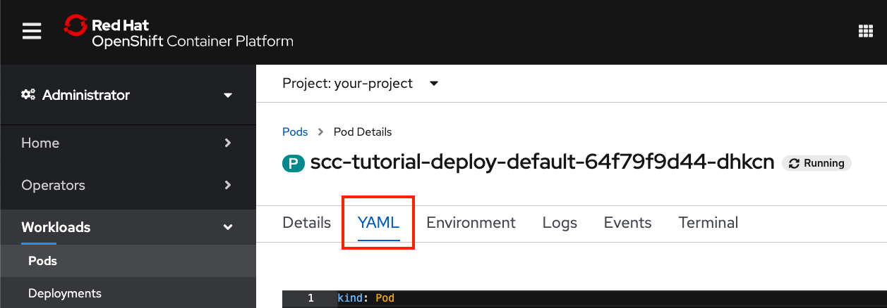
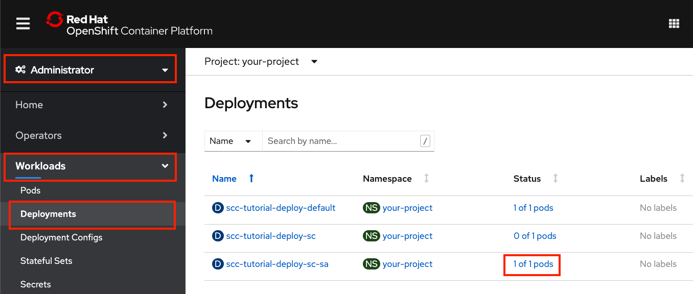

# Use security context constraints to restrict and empower your OpenShift workloads

## Introduction

This hands-on tutorial is intended for developers and cluster administrators who are interested in learning how to deploy workloads on a Red Hat OpenShift cluster in a secure way.

Using security context contraints (SCCs), you'll learn how to give a workload the least amount of permissions necessary to perform its work. This best practice helps to protect your cluster from both intentional and accidental harm while providing a way to request and grant additional permissions when necessary.

For example, if it is necessary for your container to run as a specific user or group, you specify a `runAsUser` or `runAsGroup` in the security context. If you need to be a member of additional groups, you specify `supplementalGroups`. To allow these requests, a cluster administrator creates and assigns an SCC with contraints that allow what you need while still restricting special privileges that you don't need.

In this tutorial, you will create a simple deployment. Deployments rollout replica sets which bring up pods as requested in a spec. This tutorial uses a simple pod that mounts an ephemeral volume and runs a single container. We can use a remote shell to run commands on the container to examine its runtime environment and permissions.

You will learn how to:

* Check the pod YAML, to see what SCC and security context it was assigned
* Test access permissions using a default service account and default security context
* Find an error event that shows a security context constraint validation error
* Create an SCC and assign it to a service account
* Use a security context that requests special permissions with an SCC that allows them

## Concepts

Before attempting this hands-on tutorial, you may want to learn about the concepts for how security context constraints are used: "[Introduction to Red Hat OpenShift security context constraints](https://github.ibm.com/TT-ISV-org/scc/blob/main/article/intro.md)." That article explains these overall concepts:

An application's access to protected functions is an agreement between three personas:

* A **developer** who writes an application that accesses protected functions
* A **deployer** who writes the deployment manifest that must request the access the application requires
* An **administrator** who decides whether to grant the deployment the access it requests

This diagram illustrates the components and process that allow an application to access resources:


1. A developer writes an application
1. A deployer creates a **deployment manifest** to deploy the application with a pod spec that configures:
    * A **security context** (for the pod and/or for each container) that requests the access needed by the application
    * A **service account** to grant the requested access
1. An administrator assigns a **security context constraint** to the service account that grants the requested access
    * The SCC can be assigned directly to the service account or indirectly via an RBAC role or group
1. The SCC may be one of OpenShift's predefined SCCs or may be a custom SCC
1. If the SCC grants the access, the admission process allows the pod to deploy

> **NOTE**: An OpenShift service account is a special type of user account that can be used programmatically without using a regular user’s credentials.

## Prerequisites

* Access to an OpenShift cluster
* Cluster admin permission
* The OpenShift CLI (oc)
* A bash or zsh terminal (or similar)
* An OpenShift project to work in

> **NOTE**: This tutorial demonstrates how SCCs can manage file access permissions and ownership settings using Linux features like user, group, file system group, and supplemental groups. For a refresher on these features, check out "[Learn Linux, 101: Manage file permissions and ownership](https://developer.ibm.com/tutorials/l-lpic1-104-5/)."

## Steps

1. [Create a default deployment](#step-1-create-a-default-deployment)
    * Deploy a workload using a Universal Base Image
    * Examine the default security contexts and SCC
    * Test your container's runtime permissions
1. [Attempt a deployment with security contexts](#step-2-attempt-a-deployment-with-security-contexts)
    * Request special permissions for your deployment
    * See how a deployment fails when requesting permissions that have not been assigned
1. [Create and assign a security context constraint](#step-3-create-and-assign-a-security-context-constraint)
    * Create an SCC to allow your deployment's security contexts
    * Create a role that can use the SCC
    * Bind the role to a service account
1. [Create a deployment using the service account that can use the SCC](#step-4-create-a-deployment-using-the-service-account-that-can-use-the-SCC)
    * Now the deployment can be validated with an SCC
    * Examine the resulting security contexts and selected SCC
    * Test your container's new runtime permissions

### Personas

Steps 1, 2, and 4 are performed by a user with permission to create deployments (the deployer). The deployer is responsible for specifying security contexts to request the permissions required by the pod and container. The deployer can also select the service account that will be used to validate the requested permissions.

Step 3 is performed by a cluster admin. Creating and assigning SCCs can be done to restrict permissions, but it can also relax permissions and create vulnerabilities. Because of this, it is up to the cluster admin to determine which SCCs should be allowed in the cluster and when to assign them to project service accounts.

> **WARNING**: Once privileges have been given to an SCC and the SCC has been granted to a project service account (e.g. via a role binding), any deployer in the project can take advantage of those privileges.

## Step 1: Create a default deployment

In this first step, you will:

* Deploy a simple workload using a Universal Base Image
* Examine the default security contexts and SCC
* Test your container's runtime permissions

You will see:

* The SCC that was assigned by default
* The default security contexts added for your pod and container
* The user ID assigned to run the container
* The user's group memberships
* How the user ID and group memberships affect data access

### Deploy a workload using a Universal Base Image

By running a Red Hat Universal Base Image and mounting an EmptyDir volume, you won't see a full-stack application, but it is easy to run some commands on the container to see what the environment looks like and test the privileges and access controls on the ephemeral mounted volume.

1. Start in a terminal.

    * Login with your credentials
    * Switch to the project

    ```bash
    oc login <your-credentials>
    oc project <your-project>
    ```

1. Download the deployment manifest YAML file from [here](static/deploy_default.yaml) or copy/paste and save it to a file named deploy_default.yaml.

    ```yaml
    apiVersion: apps/v1
    kind: Deployment
    metadata:
      name: scc-tutorial-deploy-default
    spec:
      selector:
        matchLabels:
          app: scc-tutorial-default
      template:
        metadata:
          labels:
            app: scc-tutorial-default
        spec:
          containers:
          - image: ubi8/ubi-minimal
            name: ubi-minimal
            command: ['sh', '-c', 'echo "Hello from user $(id -u)" && sleep infinity']
            volumeMounts:
            - mountPath: /var/opt/app/data
              name: data
          serviceAccountName: default
          volumes:
          - emptyDir: {}
            name: data
    ```

1. Run the following command to create the deployment.

    ```bash
    oc create -f deploy_default.yaml
    ```

### Examine the default security contexts and SCC

You can get the full YAML description of the pod to see details. For this tutorial, the interesting part is the annotation that shows what SCC was used, the container securityContext, and the pod securityContext. Also worth noting, is that we explicitly specified the `default` service account in our manifest for completeness. We would normally leave that out to use the default service account (because `default` is the default).

You can use the OpenShift Web Console or use the `oc` command line interface in your terminal to see the results.

<details><summary>Using the command line interface</summary>
<p>

* To get the details for the pod, use `oc get` with the label `app=scc-tutorial-default` and the `yaml` output option.

  ```bash
  oc get pod -l app=scc-tutorial-default -o yaml
  ```

* Just showing the interesting parts here (explained more in the next section):

  ```yaml
    ...
    metadata:
      annotations:
        ...
        openshift.io/scc: restricted
        ...
    spec:
      containers:
        ...
        securityContext:
          capabilities:
            drop:
            - KILL
            - MKNOD
            - SETGID
            - SETUID
          runAsUser: 1000620000
          ...
      securityContext:
        fsGroup: 1000620000
        seLinuxOptions:
          level: s0:c25,c10
      serviceAccount: default
      serviceAccountName: default
      ...
  ```

<p>
</details>
<p>
<details><summary>Using the OpenShift Web Console</summary>
<p>

  * Check the status of your deployment:

      * Use the sidebar pulldown to select `Administrator`
      * Expand `Workloads`
      * Select `Deployments`
      * `Status` should say `1 of 1 pods`

      

  * Check the details of your pod:

      * Click on the deployment status `1 of 1 pods` link
      * Click on the pod name `scc-tutorial-deploy-default-<generated-suffix>`
      * Select the `YAML` tab

      

</details>
<p>

#### What did we find?

* The pod YAML shows the SCC that was assigned.

  * The SCC is shown in `annotations`.
  * Our default deployment got the `restricted` SCC. This was the highest priority, most restrictive SCC available to the service account.

  

* Scroll down to see the service account, pod security context and container security context.

  * `serviceAccountName` is `default`. We'll change this later.
  * `securityContext` for the pod was given `seLinuxOptions` and an `fsGroup` setting. These came from the project defaults.
  * `securityContext` for the container was given some specific `capabilities` to `drop` and a `runAsUser`. These are also from the project defaults. Notice that the container's `runAsUser` is the same as the pod's `fsGroup`.

  

### Test your container's runtime permissions

Let's see how these settings affect our container's runtime permissions.

1. Use the OpenShift Web Console or use the `oc` command line interface in your terminal to see the results.

    <details><summary>Using the command line interface</summary>
    <p>

    * Get the pod name:

      ```bash
      oc get pod -l app=scc-tutorial-default 
      ```

    * Remote shell into the pod's container:

      ```bash
      oc rsh <pod-name>
      ```
    </details>
    <p>
    <details><summary>Using the OpenShift Web Console</summary>
    <p>

    * Select the `Terminal` tab on the pod details page

      

    </details>
    <p>

1. Check the user ID and group memberships

    | Command | Description |
    | -       | -           |
    | `whoami` | Show your user ID |
    | `id`     | Show your user ID (uid), group ID (gid) and group memberships |

    

    What does this show us?

    * With the restricted SCC, we got the user ID and group IDs from the project defaults. Remember, we did not specify any user ID or group ID in our deployment manifest.
    * The uid is the one that we saw assigned in the container `securityContext.runAsUser`.
    * This uid has been assigned to the root group (ID 0) as its default gid.
    * The user is also a member of the file system group. In this case, the file system group is the same as the uid. We saw this assigned in the pod `securityContext.fsGroup`.

1. Let's see how the file system group was used for our volume

    | Command | Description |
    | -       | -           |
    | `ls -ld / /tmp /var/opt/app/data` | Show permissions on the root directory, the temp directory, and the mounted volume |

    

    What does this show us?

    * The volume was mounted at /var/opt/app/data (as specified in the manifest).
    * The volume directory's group ID is our fsGroup ID, and "set-group-ID" mode is set (i.e. the sticky bit forces files created in this directory to be owned by this group ID).
    * For comparison, the root and temp directories do not use the fsGroup ID. The temp directory is writable for every user. The root directory is only writable for the root user.

1. See what happens when you write a file

    | Command | Description |
    | -       | -           |
    | `echo hello > /var/opt/app/data/volume.txt` | Write to a file on the volume |
    | `echo hello > /tmp/temp.txt` | Write to a file in the temp directory |
    | `echo hello > /fail.txt` | Try to write a file in the root directory |
    | `ls -l /tmp/temp.txt /var/opt/app/data/volume.txt` | Check the permissions on our files |

    

    What does this show us?

    * The file that we wrote on the volume is owned by our user ID and file system group ID (because of the sticky bit). This is really significant. In the next step, we'll get to choose the group that we want to share files with (instead of this default ID).
    * The file that we wrote in the temp directory is owned by our user ID and our default group ID (root). We're just using this local file behavior to highlight the effect of the file system group on our mounted volume.
    * We don't have write permission in the root directory. This just emphasizes that we are not running as root or as a privileged user.

We avoided running as root, but we did not choose our user or group IDs. We'll do that next.

## Step 2: Attempt a deployment with security contexts

Let's say we are deploying an application where we need a specific user ID, and we also want to use a shared group ID for data access. This one example covers the use cases mentioned earlier.

The first thing we need to do is use security contexts in our deployment manifest to specify the expected user ID and group IDs for our pod and container.

These security contexts are validated against SCCs that are assigned to the service account. If there is not an SCC that can validate the security contexts, then the pod will not be started.

### Request special permissions for your deployment

We've added security contexts, for the pod and the container, to request the following settings for access control:

* Run as user ID 1234
* Run as group ID 5678
* Add supplemental group IDs 5777 and 5888
* Use a file system group ID of 5555

1. Download the deployment manifest YAML file from [here](static/deploy_sc.yaml) or copy/paste and save it to a file named deploy_sc.yaml.

    ```yaml
    apiVersion: apps/v1
    kind: Deployment
    metadata:
      name: scc-tutorial-deploy-sc
    spec:
      selector:
        matchLabels:
          app: scc-tutorial-sc
      template:
        metadata:
          labels:
            app: scc-tutorial-sc
        spec:
          containers:
          - image: ubi8/ubi-minimal
            name: ubi-minimal
            command: ['sh', '-c', 'echo "Hello from user $(id -u)" && sleep infinity']
            securityContext:
              runAsUser: 1234
              runAsGroup: 5678
            volumeMounts:
            - mountPath: /var/opt/app/data
              name: data
          serviceAccountName: default
          securityContext:
            fsGroup: 5555
            supplementalGroups: [5777, 5888]
          volumes:
          - emptyDir: {}
            name: data
    ```

1. Run the following `oc create` command to create the deployment.

    ```bash
    oc create -f deploy_sc.yaml
    ```

### See how a deployment fails when requesting privileges that have not been assigned

1. Check for SCC errors

    When a deployment fails due to SCC, you need to check the status of the replica set. Describe the deployment to check replica status:

    ```bash
    oc describe deployment/scc-tutorial-deploy-sc
    ```

    The output should show a ReplicaFailure:

    ```bash
    $ oc describe deployment/scc-tutorial-deploy-sc
    ...
    Replicas:               1 desired | 0 updated | 0 total | 0 available | 1 unavailable
    ...
    Conditions:
      Type             Status  Reason
      ----             ------  ------
      Progressing      True    NewReplicaSetCreated
      Available        False   MinimumReplicasUnavailable
      ReplicaFailure   True    FailedCreate
    OldReplicaSets:    <none>
    NewReplicaSet:     scc-tutorial-deploy-sc-5c4f64575c (0/1 replicas created)
    ...
    ```

    To get a more specific reason for the replica set failure. Use `oc get events`:

    ```bash
    $ oc get events | grep replicaset/scc-tutorial-deploy-sc
    2m37s       Warning   FailedCreate        replicaset/scc-tutorial-deploy-sc-5c4f64575c        Error creating: pods "scc-tutorial-deploy-sc-5c4f64575c-" is forbidden: unable to validate against any security context constraint: [fsGroup: Invalid value: []int64{5555}: 5555 is not an allowed group spec.containers[0].securityContext.securityContext.runAsUser: Invalid value: 1234: must be in the ranges: [1000620000, 1000629999]]
    ```

    The `FailedCreate` warning clearly shows that we were **unable to validate against any security context constraint** due to our fsGroup and runAsUser values.

    This error is expected because the deployment manifest asked for specific permissions, and the default service account cannot use any SCC that will allow these permissions. This tells you that either the deployer has requested too much access in the manifest, or the cluster admin needs to provide an SCC that allows more access.

    We did not fail to "create the deployment". You can use `oc get deployment` or use the OpenShift Web Console to look for it. A deployment named `scc-tutorial-deploy-sc` was created. A replica set named `scc-tutorial-deploy-sc-<generated-suffix>` was also created. But both show 0-of-1 pods were created, and the replica set has that event that explains the problem.

    So, instead of deploying an application that will eventually run into data access errors, we made it fail earlier with reasons. Failing early is definitely a good thing. The other thing we accomplished, by clearly indicating the special permissions needed by this application, is that we created a way for the developer, the deployer, and the security administrator to better communicate the special security requirements of this deployment.

## Step 3: Create and assign a security context constraint

*You must be a cluster admin for this step.*

You will use security context constraints (SCCs) along with role based access controls (RBAC) to provide your workloads with the privileges they need to perform their work.

1. Download the YAML file from [here](static/scc-tutorial-scc.yaml) or copy/paste and save it to a file named scc-tutorial-scc.yaml.

    ```yaml
    kind: SecurityContextConstraints
    apiVersion: v1
    metadata:
      name: scc-tutorial-scc
    allowPrivilegedContainer: false
    runAsUser:
      type: MustRunAsRange 
      uidRangeMin: 1000
      uidRangeMax: 2000
    seLinuxContext:
      type: RunAsAny
    fsGroup:
      type: MustRunAs 
      ranges:
      - min: 5000
        max: 6000
    supplementalGroups:
      type: MustRunAs 
      ranges:
      - min: 5000
        max: 6000
    ```

1. Run the following command to create the SecurityContextConstraint.

    ```bash
    oc create -f scc-tutorial-scc.yaml
    ```

1. Create a new service account

    Run the following command to create a service account. We don't want to modify the default one for this.

    ```bash
    oc create sa scc-tutorial-sa
    ```

1. Download the YAML file from [here](static/rbac.yaml) or copy/paste and save it to a file named rbac.yaml.

    ```yaml
    ---
    kind: Role
    apiVersion: rbac.authorization.k8s.io/v1
    metadata:
      name: use-scc-tutorial-scc
    rules:
      - apiGroups: ["security.openshift.io"]
        resources: ["securitycontextconstraints"]
        resourceNames: ["scc-tutorial-scc"]
        verbs: ["use"]
    ---
    kind: RoleBinding
    apiVersion: rbac.authorization.k8s.io/v1
    metadata:
      name: use-scc-tutorial-scc
    subjects:
      - kind: ServiceAccount
        name: scc-tutorial-sa
    roleRef:
      kind: Role
      name: use-scc-tutorial-scc
      apiGroup: rbac.authorization.k8s.io
    ```

1. Run the following command to create the role and bind it to your service account.

    ```bash
    oc create -f rbac.yaml
    ```

### Review what was done

As a cluster-admin:

* You created an SCC called `scc-tutorial-scc`.
* You created a service account called `scc-tutorial-sa`.
* You created a role and role binding, both called `use-scc-tutorial-scc`.

As part of creating the role and role binding, you've associated the SCC with the role and bound it to the service account (SA). This associates the SA with the SCC such that any pod running as the SA has access to the SCC.

In the next step, as a deployer, you will use this SA to fix the deployment that failed to validate your security contexts in the previous step.

## Step 4: Create a deployment using the service account that can use the SCC

### Now the deployment can be validated with an SCC

For your 3rd try, we changed the `serviceAccountName` to use your new service account.

1. Download the YAML file from [here](static/deploy_sc_sa.yaml) or copy/paste and save it to a file named deploy_sc_sa.yaml.

    ```yaml
    apiVersion: apps/v1
    kind: Deployment
    metadata:
      name: scc-tutorial-deploy-sc-sa
    spec:
      selector:
        matchLabels:
          app: scc-tutorial-sc-sa
      template:
        metadata:
          labels:
            app: scc-tutorial-sc-sa
        spec:
          containers:
          - image: ubi8/ubi-minimal
            name: ubi-minimal
            command: ['sh', '-c', 'echo "Hello from user $(id -u)" && sleep infinity']
            securityContext:
              runAsUser: 1234
              runAsGroup: 5678
            volumeMounts:
            - mountPath: /var/opt/app/data
              name: data
          serviceAccountName: scc-tutorial-sa
          securityContext:
            fsGroup: 5555
            supplementalGroups: [5777, 5888]
          volumes:
          - emptyDir: {}
            name: data
    ```

1. Run the following command to create the deployment.

    ```bash
    oc create -f deploy_sc_sa.yaml
    ```

### Examine after adding custom security contexts and SCC

Now that we've customized the security contexts and created a custom SCC to validate it, let's look at the results.

Get the full YAML description of the pod to see details. For this tutorial, the interesting part is the annotation that shows what SCC was used, the container securityContext, and the pod securityContext. Also worth checking, is that we used oiur `scc-tutorial-sa` service account.

Use the OpenShift Web Console or use the `oc` command line interface in your terminal to see the results.

<details><summary>Using the command line interface</summary>
<p>

* To get the details for the pod, use `oc get` with the label `app=scc-tutorial-sc-sa` and the `yaml` output option.

    ```bash
    oc get pod -l app=scc-tutorial-sc-sa -o yaml
    ```

* Just showing the interesting parts here (explained more in the next section):

    ```yaml
      ...
      metadata:
        annotations:
          ...
          openshift.io/scc: scc-tutorial-scc
          ...
      spec:
        containers:
          ...
          securityContext:
            runAsGroup: 5678
            runAsUser: 1234
            ...
          volumeMounts:
          - mountPath: /var/opt/app/data
          ...
        securityContext:
          fsGroup: 5555
          supplementalGroups:
          - 5777
          - 5888
        serviceAccount: scc-tutorial-sa
        serviceAccountName: scc-tutorial-sa
        ...
    ```
<p>
</details>
<p>
<details><summary>Using the OpenShift Web Console</summary>
<p>

* Check the status of your deployment:

    * Use the sidebar pulldown to select `Administrator`
    * Expand `Workloads`
    * Select `Deployments`
    * Find `scc-tutorial-deploy-sc-sa`
    * `Status` should say `1 of 1 pods`

    

* Check the details of your pod:

    * Click on the deployment status `1 of 1 pods` link
    * Click on the pod name `scc-tutorial-deploy-sc-sa-<generated-suffix>`
    * Select the `YAML` tab

<p>
</details>
<p>

#### What did we find?

* The pod YAML shows the SCC that was assigned.

  * The SCC is shown in `annotations`.
  * This deployment used our new `scc-tutorial-scc` SCC. This was the highest priority, most restrictive SCC that was able to validate our security contexts (and was available to our service account).

  

* Scroll down to see the pod spec. Instead of defaults, you'll see that our manifest determined the security contexts.

  * `SecurityContext` for the pod was given `fsGroup: 5555` and `supplementalGroups: [5777, 5888]`
  * `SecurityContext` for the container was given `runAsUser: 1234` and `runAsGroup: 5678`.
  * The volume was mounted at `/var/opt/app/data`
  * `ServiceAccountName` is `scc-tutorial-sa` (the service account we just created and assigned our one SSC)

  

### Test your container's runtime permissions

1. Use the OpenShift Web Console or use the `oc` command line interface in your terminal to see the results.

    <details><summary>Using the command line interface</summary>
    <p>

    * Get the pod name:

      ```bash
      oc get pod -l app=scc-tutorial-sc-sa
      ```

    * Remote shell into the pod's container:

      ```bash
      oc rsh <pod-name>
      ```

    <p>
    </details>
    <p>
    <details><summary>Using the OpenShift Web Console</summary>
    <p>

    * Select the `Terminal` tab on the pod details page
    <p>
    </details>
    <p>

1. Check the user ID and group memberships

    | Command | Description |
    | -       | -           |
    | `whoami` | Show your user ID |
    | `id`     | Show your user ID (uid), group ID (gid) and group memberships |

    

    What does this show us?

    * We are using the user ID (uid) or group ID (gid) from our deployment manifest.
    * The supplemental groups that we requested were also created, and our user is a member of those groups.
    * The user is also a member of the file system group. We specified this ID in the pod `securityContext.fsGroup`.

1. Let's see how the file system group was used for our volume

    | Command | Description |
    | -       | -           |
    | `ls -ld / /tmp /var/opt/app/data` | Show permissions on the root directory, the temp directory, and the mounted volume |

    

    What does this show us?

    * The volume was mounted at /var/opt/app/data (as specified in the manifest).
    * The volume directory's group ID is the fsGroup that we requested in our manifest.
    * The "set-group-ID" mode is set (i.e. the sticky bit forces files created in this directory to be owned by this group ID).
    * The root and temp directories have not changed from our default example.

1. See what happens when you write a file

    | Command | Description |
    | -       | -           |
    | `echo hello > /var/opt/app/data/volume.txt` | Write to a file on the volume |
    | `echo hello > /tmp/temp.txt` | Write to a file in the temp directory |
    | `echo hello > /fail.txt` | Try to write a file in the root directory |
    | `ls -l /tmp/temp.txt /var/opt/app/data/volume.txt` | Check the permissions on our files |

    

    What does this show us?

    * In `/tmp` the file we created is owned by `1234/5678` (our specified uid/gid instead of a project default like `1000620000/root`).
    * On the volume, the file we created is owned by `1234/5555` (our specified uid/fsGroup instead of a project default like `1000620000/1000620000`).
    * We avoided running as root, and using the root group.
    * If our volume was shared storage, containers with different uids **would** be able to share data with members of the same group.
    * This example only used the fsGroup, but you can see that the other supplemental groups that we specified were also created and assigned to the user.

Of particular interest (for our examples) is the behavior of the file system group (fsGroup). This special group is used for mounting volumes. When a file system is backed by storage that supports fsGroup, the directory permissions are set so that files created in this directory are owned by the group. This allows file sharing for containers that run as different users in the same group (e.g., 2 containers in one pod or multiple pod instances using persistent volumes). For other directories, or other types of storage, the supplemental groups can be used the similarly, by setting the desired supplemental group as a directory or file owner.

## Clean up

You can delete the resources that you created during this tutorial with the following commands.

```bash
oc delete deployment/scc-tutorial-deploy-default
oc delete deployment/scc-tutorial-deploy-sc
oc delete deployment/scc-tutorial-deploy-sc-sa
oc delete rolebindings/use-scc-tutorial-scc
oc delete role/use-scc-tutorial-scc
oc delete sa/scc-tutorial-sa
oc delete scc/scc-tutorial-scc
```

## Conclusion

### What did we learn?

1. We can check the YAML of a running pod to see what SCC the cluster assigned to the pod.

1. We used a security context to indicate that our deployment is requesting permission to:

    * Run as user ID 1234
    * Run as a group ID 5678
    * Use supplemental groups 5777 and 5888
    * Use fsGroup 5555 to allow read/write on a volume

1. We allowed security context constraint validation to fail using the default service account and restricted SCC (because we did not have permission to do all those things yet), and we learned how to find the error message.

1. We created an SCC with the permissions we needed.

1. We created a service account and assigned the SCC to it

1. We were successful in creating a pod/container with the security context settings that we wanted.

### Next steps?

1. Try a similar exercise using an image of your own application or a 3rd-party application that you use.

1. Experiment with other security context and SCC settings.

1. Learn to give your workloads the least permissions necessary to do their work.
